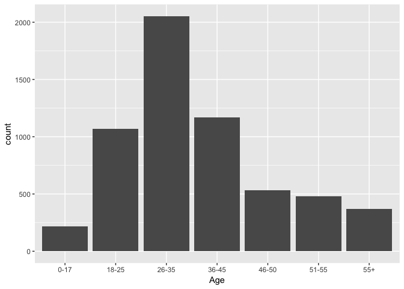
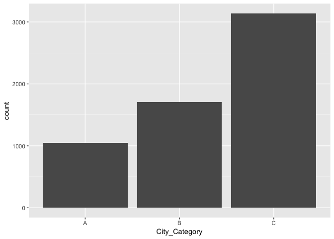
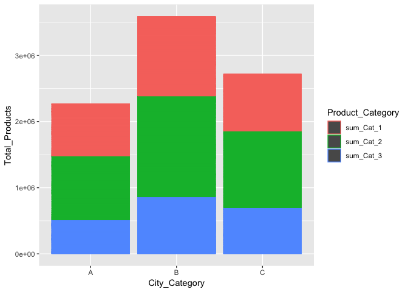
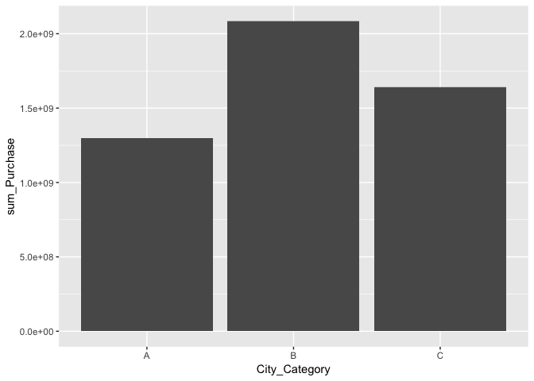
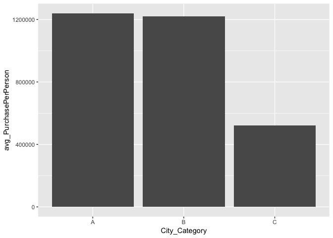
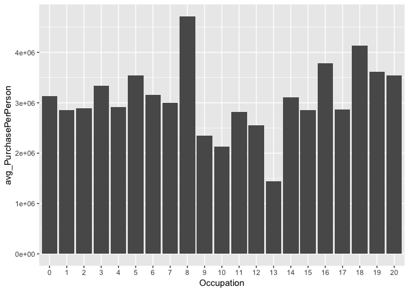
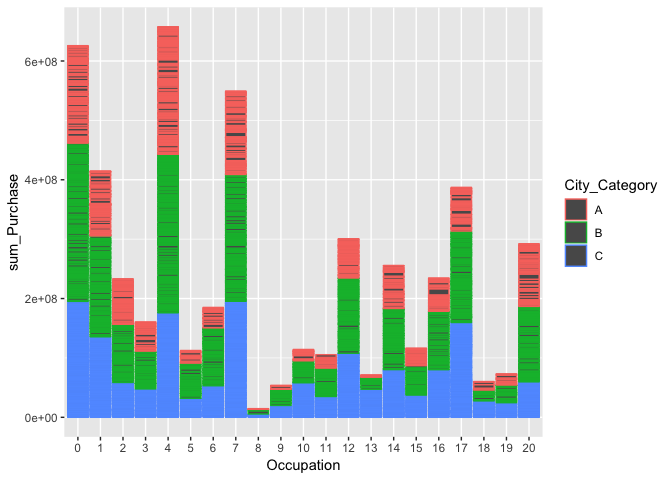
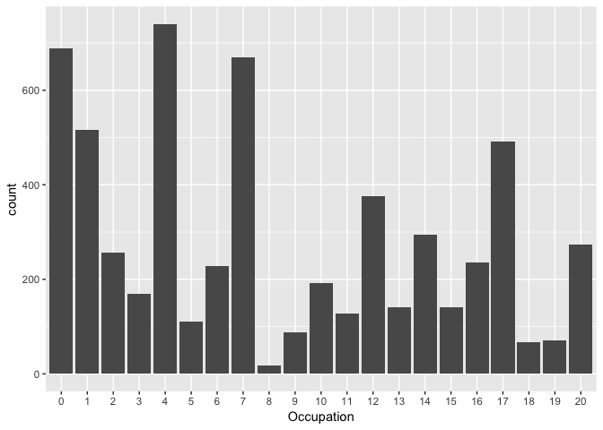

Black Friday
================
Lisa Leung
2019-01-26

Load all libraries
------------------

``` r
library(tidyverse)
```

    ## ── Attaching packages ──────────────────────────────────────────────────────────────────────────────────── tidyverse 1.2.1 ──

    ## ✔ ggplot2 3.1.0     ✔ purrr   0.2.4
    ## ✔ tibble  1.4.2     ✔ dplyr   0.7.4
    ## ✔ tidyr   0.8.0     ✔ stringr 1.3.0
    ## ✔ readr   1.1.1     ✔ forcats 0.3.0

    ## ── Conflicts ─────────────────────────────────────────────────────────────────────────────────────── tidyverse_conflicts() ──
    ## ✖ dplyr::filter() masks stats::filter()
    ## ✖ dplyr::lag()    masks stats::lag()

``` r
library(ggmosaic)
```

Importing data set
------------------

Please download file from Kaggle "BlackFriday.csv". Data set will not be uploadeded in github

``` r
dat_Raw <- read_csv("BlackFriday.csv")
```

    ## Parsed with column specification:
    ## cols(
    ##   User_ID = col_integer(),
    ##   Product_ID = col_character(),
    ##   Gender = col_character(),
    ##   Age = col_character(),
    ##   Occupation = col_integer(),
    ##   City_Category = col_character(),
    ##   Stay_In_Current_City_Years = col_character(),
    ##   Marital_Status = col_integer(),
    ##   Product_Category_1 = col_integer(),
    ##   Product_Category_2 = col_integer(),
    ##   Product_Category_3 = col_integer(),
    ##   Purchase = col_integer()
    ## )

``` r
head(dat_Raw) # take a look at what's inside this csv file
```

    ## # A tibble: 6 x 12
    ##   User_ID Product_ID Gender Age   Occupation City_Category
    ##     <int> <chr>      <chr>  <chr>      <int> <chr>        
    ## 1 1000001 P00069042  F      0-17          10 A            
    ## 2 1000001 P00248942  F      0-17          10 A            
    ## 3 1000001 P00087842  F      0-17          10 A            
    ## 4 1000001 P00085442  F      0-17          10 A            
    ## 5 1000002 P00285442  M      55+           16 C            
    ## 6 1000003 P00193542  M      26-35         15 A            
    ## # ... with 6 more variables: Stay_In_Current_City_Years <chr>,
    ## #   Marital_Status <int>, Product_Category_1 <int>,
    ## #   Product_Category_2 <int>, Product_Category_3 <int>, Purchase <int>

``` r
colnames(dat_Raw) # what variables?
```

    ##  [1] "User_ID"                    "Product_ID"                
    ##  [3] "Gender"                     "Age"                       
    ##  [5] "Occupation"                 "City_Category"             
    ##  [7] "Stay_In_Current_City_Years" "Marital_Status"            
    ##  [9] "Product_Category_1"         "Product_Category_2"        
    ## [11] "Product_Category_3"         "Purchase"

Doing some sanity checks
------------------------

``` r
class(dat_Raw$Occupation) #Occupation is in integer value
```

    ## [1] "integer"

``` r
dat_Raw$Occupation <- as.factor(dat_Raw$Occupation)

dim(dat_Raw)
```

    ## [1] 537577     12

``` r
length(unique(dat_Raw$User_ID))
```

    ## [1] 5891

It seems that each row on the data set is looking at unique combinations of user ID and product ID. There are a total of 5891 users in the data set with 537577 transactions in the data set. I'd like to aggregate them to another data set by user ID so I can better understand consumer behaviours

``` r
dat_User <- dat_Raw %>% group_by(User_ID, 
                                 Gender, 
                                 Age, 
                                 Occupation, 
                                 City_Category, 
                                 Stay_In_Current_City_Years, 
                                 Marital_Status) %>% 
  summarise(sum_Cat_1 = sum(na.omit(Product_Category_1)),
            sum_Cat_2 = sum(na.omit(Product_Category_2)),
            sum_Cat_3 = sum(na.omit(Product_Category_3)),
            sum_Purchase = sum(Purchase))
```

    ## Warning: `as_dictionary()` is soft-deprecated as of rlang 0.3.0.
    ## Please use `as_data_pronoun()` instead
    ## This warning is displayed once per session.

    ## Warning: `new_overscope()` is soft-deprecated as of rlang 0.2.0.
    ## Please use `new_data_mask()` instead
    ## This warning is displayed once per session.

    ## Warning: The `parent` argument of `new_data_mask()` is deprecated.
    ## The parent of the data mask is determined from either:
    ## 
    ##   * The `env` argument of `eval_tidy()`
    ##   * Quosure environments when applicable
    ## This warning is displayed once per session.

    ## Warning: `overscope_clean()` is soft-deprecated as of rlang 0.2.0.
    ## This warning is displayed once per session.

``` r
write.csv(dat_User, "BlackFriday-User.csv", row.names = F)
```

Let's briefly take a look at some plots
---------------------------------------

``` r
# Age
print(ggplot(dat_User, aes(x = Age)) +
  geom_bar())
```



We see that most consumers are between 26-35 category. Be aware that the bins are not of equal age years! First bin is of 17 years Second bin is of 7 years Third bin is of 9 years Fourth bin is of 9 years Fifth bin is of 4 years Sixth bin is of 4 years Seventh bin is of rest

``` r
# City
print(ggplot(dat_User, aes(x = City_Category)) +
  geom_bar())
```

 There are city A, B, and C. All three cities have various total of customers where C would have the most unique number of customers. Would probably separate the three cities for analysis to see whether the Black Friday sales affect different categories.

``` r
# Product Categories by cities

dat_category_city_to_plot <- dat_User %>% gather(Product_Category, Total_Products, sum_Cat_1:sum_Cat_3, factor_key=T) #converting to long format
print(ggplot(dat_category_city_to_plot, aes(x = City_Category, y=Total_Products, colour= Product_Category)) +
  geom_col())
```

 The ratio of buying the number of products between product categories doesn't seem to vary a lot across the cities. Buying behaviour of the three cities may be similar on the product categories in terms of number of products

``` r
# Amount spent by cities

print(ggplot(dat_User, aes(x = City_Category, y=sum_Purchase)) +
  geom_col())
```

 Amount purchase definitely varies between the cities. We see that most of the sales in revenue made is coming from City B. However, as shown previously, there are a lot less customers in city B than in city C. These differences between the two plots show there's a spending discrepency between the cities. Hence, when we run clustering analyses, we may consider splitting the datasets by cities first.

``` r
#Spending per person by city

dat_spendperperson_city <- dat_User %>% group_by(City_Category) %>% summarise(count_Pop = length(unique(User_ID)), all_Purchase = sum(na.omit(sum_Purchase))) %>% mutate(avg_PurchasePerPerson = all_Purchase/count_Pop) # taking summarized values on total sum of amount
print(ggplot(dat_spendperperson_city, aes(x = City_Category, y=avg_PurchasePerPerson)) +
  geom_col())
```



This definitely shows something. It seems that even though there are a lot of customers coming from city C, they spend less than half of what people spend from City A and City B. Perhaps the company by now should research into these differences between the buying behaviour amongst the cities and investigate the discrepancy on willingness to spend.

Because of the discrepenacy, I'd like to see if there are other discrepancies among the cities that might've induced their differences of spendings.

``` r
#Spending per person by occupation

dat_spendperperson_occupation <- dat_User %>% group_by(Occupation, City_Category) %>% summarise(count_Pop = n(), all_Purchase = sum(na.omit(sum_Purchase))) %>% mutate(avg_PurchasePerPerson = all_Purchase/count_Pop) # taking summarized values on total sum of amount
print(ggplot(dat_spendperperson_occupation, aes(x = Occupation, y=avg_PurchasePerPerson)) +
  geom_col())
```



``` r
# Occupational; spendings of purchases separated by occupation
print(ggplot(dat_User, aes(x = Occupation, y=sum_Purchase, colour=City_Category)) +
  geom_col())
```



``` r
print(ggplot(dat_User, aes(x = Occupation)) +
  geom_bar())
```



It may seem that the twenty different occupations could potentially be a factor in purchasing amount per person.
