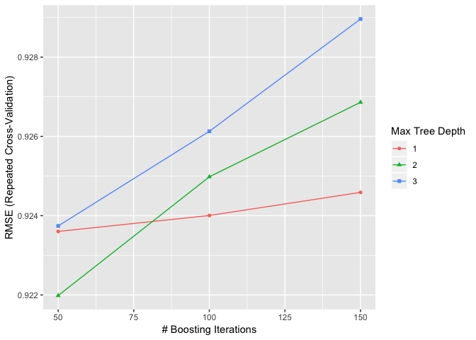
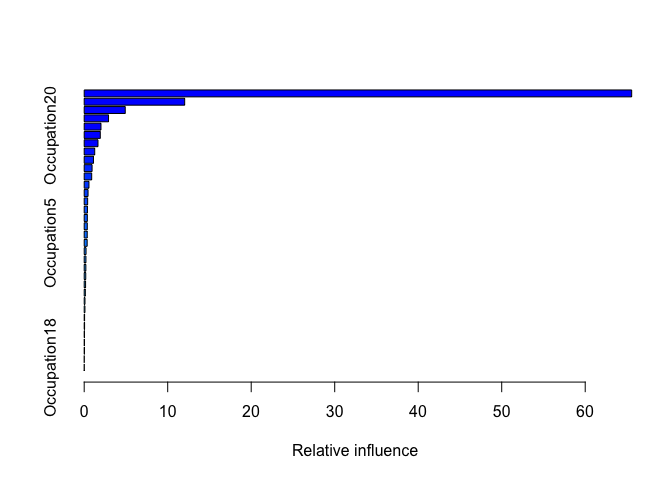
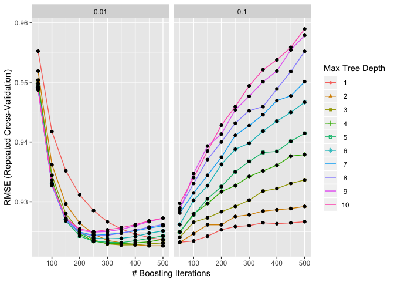
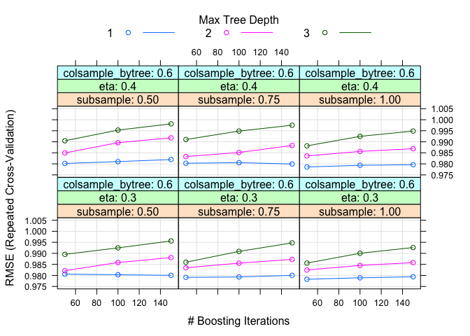
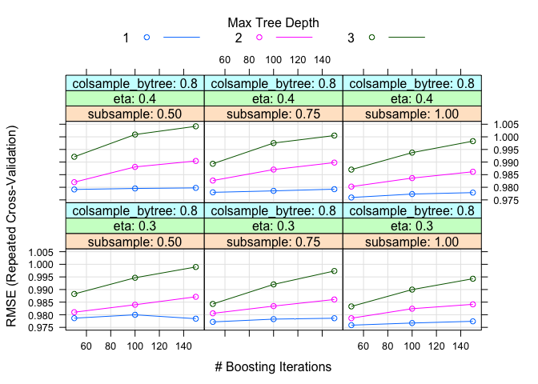

Random Forest
================
Lisa Leung
2019-01-27

Load all libraries
------------------

``` r
library(tidyverse)
```

    ## ── Attaching packages ───────────────────────────────────────────────────────────────────────────────────────────────────── tidyverse 1.2.1 ──

    ## ✔ ggplot2 3.1.0     ✔ purrr   0.2.4
    ## ✔ tibble  1.4.2     ✔ dplyr   0.7.4
    ## ✔ tidyr   0.8.0     ✔ stringr 1.3.0
    ## ✔ readr   1.1.1     ✔ forcats 0.3.0

    ## ── Conflicts ──────────────────────────────────────────────────────────────────────────────────────────────────────── tidyverse_conflicts() ──
    ## ✖ dplyr::filter() masks stats::filter()
    ## ✖ dplyr::lag()    masks stats::lag()

``` r
library(caret)
```

    ## Loading required package: lattice

    ## Warning in as.POSIXlt.POSIXct(Sys.time()): unknown timezone 'zone/tz/2018i.
    ## 1.0/zoneinfo/America/Vancouver'

    ## 
    ## Attaching package: 'caret'

    ## The following object is masked from 'package:purrr':
    ## 
    ##     lift

``` r
library(randomForest)
```

    ## randomForest 4.6-14

    ## Type rfNews() to see new features/changes/bug fixes.

    ## 
    ## Attaching package: 'randomForest'

    ## The following object is masked from 'package:dplyr':
    ## 
    ##     combine

    ## The following object is masked from 'package:ggplot2':
    ## 
    ##     margin

``` r
library(xgboost)
```

    ## 
    ## Attaching package: 'xgboost'

    ## The following object is masked from 'package:dplyr':
    ## 
    ##     slice

Purpose
-------

We will conduct random forest to predict the amount of purchase made.

Because amount of purchase made is very well known to be highly correlated with the product category, I will omit the product category and try to instead find more information about who are the consumers who have bought a lot more than the others according to their demographics. Hence, we will not see product category as a predictor in my models.

``` r
# Loading data
dat_User <- read_csv("BlackFriday-User.csv")
```

    ## Parsed with column specification:
    ## cols(
    ##   User_ID = col_integer(),
    ##   Gender = col_character(),
    ##   Age = col_character(),
    ##   Occupation = col_integer(),
    ##   City_Category = col_character(),
    ##   Stay_In_Current_City_Years = col_character(),
    ##   Marital_Status = col_integer(),
    ##   sum_Cat_1 = col_integer(),
    ##   sum_Cat_2 = col_integer(),
    ##   sum_Cat_3 = col_integer(),
    ##   sum_Purchase = col_integer(),
    ##   sum_Purchase_log = col_double()
    ## )

``` r
dat_User <- dat_User[,!colnames(dat_User) %in% c("X1", "User_ID")]
dat_User$Occupation <- as.factor(dat_User$Occupation) #converting to a factor


# Train and Test data
set.seed(10)
num <- round(nrow(dat_User)/2)
vec_Train <- sample(1:nrow(dat_User),size = num)

dat_Train <- dat_User[vec_Train,]
dat_Test <- dat_User[-vec_Train,]
```

Multiple Regression
-------------------

Before starting random forest, I want to use a multiple regression as a base model on the data set.

``` r
lm_multiple <- lm(sum_Purchase_log~Gender+Age+Occupation+City_Category+Stay_In_Current_City_Years + Marital_Status, data=dat_Train)
summary(lm_multiple)
```

    ## 
    ## Call:
    ## lm(formula = sum_Purchase_log ~ Gender + Age + Occupation + City_Category + 
    ##     Stay_In_Current_City_Years + Marital_Status, data = dat_Train)
    ## 
    ## Residuals:
    ##      Min       1Q   Median       3Q      Max 
    ## -2.85545 -0.71172  0.01032  0.74333  2.30126 
    ## 
    ## Coefficients:
    ##                               Estimate Std. Error t value Pr(>|t|)    
    ## (Intercept)                  13.072132   0.157391  83.055  < 2e-16 ***
    ## GenderM                       0.290068   0.039270   7.386 1.96e-13 ***
    ## Age18-25                      0.077453   0.143060   0.541   0.5883    
    ## Age26-35                      0.229262   0.144133   1.591   0.1118    
    ## Age36-45                      0.194527   0.146806   1.325   0.1853    
    ## Age46-50                      0.122307   0.154773   0.790   0.4295    
    ## Age51-55                      0.119889   0.155619   0.770   0.4411    
    ## Age55+                       -0.117073   0.160610  -0.729   0.4661    
    ## Occupation1                  -0.009301   0.076858  -0.121   0.9037    
    ## Occupation2                  -0.038689   0.095091  -0.407   0.6841    
    ## Occupation3                   0.206400   0.107512   1.920   0.0550 .  
    ## Occupation4                   0.076803   0.073941   1.039   0.2990    
    ## Occupation5                   0.106042   0.134842   0.786   0.4317    
    ## Occupation6                   0.008477   0.103841   0.082   0.9349    
    ## Occupation7                  -0.021361   0.071186  -0.300   0.7641    
    ## Occupation8                  -0.098037   0.271330  -0.361   0.7179    
    ## Occupation9                  -0.058412   0.151289  -0.386   0.6995    
    ## Occupation10                  0.093366   0.153437   0.608   0.5429    
    ## Occupation11                 -0.077632   0.118998  -0.652   0.5142    
    ## Occupation12                 -0.100327   0.085182  -1.178   0.2390    
    ## Occupation13                 -0.132076   0.131280  -1.006   0.3145    
    ## Occupation14                 -0.017752   0.090133  -0.197   0.8439    
    ## Occupation15                 -0.023466   0.116325  -0.202   0.8401    
    ## Occupation16                  0.194063   0.103885   1.868   0.0619 .  
    ## Occupation17                 -0.047484   0.076622  -0.620   0.5355    
    ## Occupation18                  0.028235   0.163848   0.172   0.8632    
    ## Occupation19                  0.400976   0.157004   2.554   0.0107 *  
    ## Occupation20                  0.214786   0.095395   2.252   0.0244 *  
    ## City_CategoryB                0.042708   0.051681   0.826   0.4087    
    ## City_CategoryC               -0.615082   0.047297 -13.005  < 2e-16 ***
    ## Stay_In_Current_City_Years1   0.018235   0.056107   0.325   0.7452    
    ## Stay_In_Current_City_Years2   0.053227   0.061627   0.864   0.3878    
    ## Stay_In_Current_City_Years3   0.076555   0.064594   1.185   0.2360    
    ## Stay_In_Current_City_Years4+  0.062911   0.065056   0.967   0.3336    
    ## Marital_Status                0.010455   0.037031   0.282   0.7777    
    ## ---
    ## Signif. codes:  0 '***' 0.001 '**' 0.01 '*' 0.05 '.' 0.1 ' ' 1
    ## 
    ## Residual standard error: 0.9206 on 2911 degrees of freedom
    ## Multiple R-squared:  0.1481, Adjusted R-squared:  0.1382 
    ## F-statistic: 14.89 on 34 and 2911 DF,  p-value: < 2.2e-16

According to a summary of the multiple linear regression, we see that gender, cities, and occupations play a huge role in log(total purchases made). I'd like to also see all three cities and check if there are any other differences among the cities.

A couple of measures we will use to compare multiple linear regression to random forests:

Multiple R-squared is squared of correlation between fitted and actual values. For the multiple linear regression on the training data, it would be 0.1481. Residual standard error is root(mean squared error). For the multiple linear regression on training data, it would be 0.9206.

In addition to those two measures, I will also compare the measures of predicted vs actual data points on the dat\_Test data set (testing data). RMSE and R-squared will also be the measures of assessing the model predictions for dat\_Test.

We're going to fit the test data into our multiple linear regression and see how well it predicts.
--------------------------------------------------------------------------------------------------

``` r
# Going to manually calculate the RMSE with the multiple linear regression
vals_predicted <- predict.lm(lm_multiple, newdata = dat_Test)
vals_errors <- dat_Test$sum_Purchase_log-vals_predicted
RMSE_lm <- sqrt(sum(vals_errors^2)/length(vals_errors))
print(RMSE_lm)
```

    ## [1] 0.9178197

``` r
# R squared on predicted values
Rsq_lm <- cor(vals_predicted, dat_Test$sum_Purchase_log)^2
print(Rsq_lm)
```

    ## [1] 0.1472413

Multiple linear regression seem to do a pretty decent job in terms of predicting values. Later, we will see if we can beat this measure through random forest regression.

As a side note, we have RMSE = 0.9178197 and R-squared = 0.1472413 on the test data set.

### Checking out regressions separated by cities

``` r
dat_A <- dat_Train[dat_Train$City_Category=="A",]
lm_multiple_A <- lm(sum_Purchase_log~Gender+Age+Occupation+Stay_In_Current_City_Years + Marital_Status, data=dat_A)
summary(lm_multiple_A)
```

    ## 
    ## Call:
    ## lm(formula = sum_Purchase_log ~ Gender + Age + Occupation + Stay_In_Current_City_Years + 
    ##     Marital_Status, data = dat_A)
    ## 
    ## Residuals:
    ##      Min       1Q   Median       3Q      Max 
    ## -2.75594 -0.80097  0.01561  0.73394  2.65600 
    ## 
    ## Coefficients:
    ##                              Estimate Std. Error t value Pr(>|t|)    
    ## (Intercept)                  13.26061    0.52463  25.276  < 2e-16 ***
    ## GenderM                       0.31107    0.11094   2.804  0.00525 ** 
    ## Age18-25                     -0.27712    0.49170  -0.564  0.57329    
    ## Age26-35                      0.03812    0.49559   0.077  0.93872    
    ## Age36-45                      0.08272    0.50442   0.164  0.86980    
    ## Age46-50                     -0.50668    0.53988  -0.938  0.34845    
    ## Age51-55                     -0.48389    0.53056  -0.912  0.36220    
    ## Age55+                       -0.74938    0.55713  -1.345  0.17923    
    ## Occupation1                   0.05661    0.20315   0.279  0.78062    
    ## Occupation2                  -0.13901    0.23011  -0.604  0.54606    
    ## Occupation3                   0.33520    0.24336   1.377  0.16902    
    ## Occupation4                   0.35103    0.18113   1.938  0.05320 .  
    ## Occupation5                   0.51382    0.37810   1.359  0.17479    
    ## Occupation6                   0.41016    0.34800   1.179  0.23912    
    ## Occupation7                   0.06855    0.19824   0.346  0.72966    
    ## Occupation8                  -0.49993    0.77565  -0.645  0.51953    
    ## Occupation9                   0.24125    0.49904   0.483  0.62901    
    ## Occupation10                 -0.32247    0.50028  -0.645  0.51950    
    ## Occupation11                  0.36501    0.36870   0.990  0.32267    
    ## Occupation12                 -0.12312    0.21614  -0.570  0.56919    
    ## Occupation13                 -0.43228    0.56719  -0.762  0.44634    
    ## Occupation14                  0.06572    0.24254   0.271  0.78652    
    ## Occupation15                  0.19948    0.30389   0.656  0.51185    
    ## Occupation16                  0.48294    0.35320   1.367  0.17216    
    ## Occupation17                  0.14217    0.23207   0.613  0.54041    
    ## Occupation18                  0.69194    0.55318   1.251  0.21159    
    ## Occupation19                  0.53198    0.50242   1.059  0.29021    
    ## Occupation20                  0.59218    0.25039   2.365  0.01842 *  
    ## Stay_In_Current_City_Years1  -0.14672    0.15602  -0.940  0.34747    
    ## Stay_In_Current_City_Years2   0.10728    0.16943   0.633  0.52690    
    ## Stay_In_Current_City_Years3  -0.05082    0.17875  -0.284  0.77628    
    ## Stay_In_Current_City_Years4+ -0.05494    0.17813  -0.308  0.75789    
    ## Marital_Status                0.08956    0.10576   0.847  0.39753    
    ## ---
    ## Signif. codes:  0 '***' 0.001 '**' 0.01 '*' 0.05 '.' 0.1 ' ' 1
    ## 
    ## Residual standard error: 1.061 on 487 degrees of freedom
    ## Multiple R-squared:  0.117,  Adjusted R-squared:  0.05901 
    ## F-statistic: 2.017 on 32 and 487 DF,  p-value: 0.00101

``` r
dat_B <- dat_Train[dat_Train$City_Category=="B",]
lm_multiple_B <- lm(sum_Purchase_log~Gender+Age+Occupation+Stay_In_Current_City_Years + Marital_Status, data=dat_B)
summary(lm_multiple_B)
```

    ## 
    ## Call:
    ## lm(formula = sum_Purchase_log ~ Gender + Age + Occupation + Stay_In_Current_City_Years + 
    ##     Marital_Status, data = dat_B)
    ## 
    ## Residuals:
    ##      Min       1Q   Median       3Q      Max 
    ## -2.59195 -0.74620  0.07357  0.79497  2.11520 
    ## 
    ## Coefficients:
    ##                               Estimate Std. Error t value Pr(>|t|)    
    ## (Intercept)                  13.253979   0.307081  43.161  < 2e-16 ***
    ## GenderM                       0.392756   0.079041   4.969 8.21e-07 ***
    ## Age18-25                     -0.099806   0.287159  -0.348   0.7283    
    ## Age26-35                      0.039681   0.292318   0.136   0.8921    
    ## Age36-45                     -0.060064   0.299972  -0.200   0.8413    
    ## Age46-50                     -0.049685   0.319082  -0.156   0.8763    
    ## Age51-55                      0.059065   0.320476   0.184   0.8538    
    ## Age55+                       -0.265585   0.354302  -0.750   0.4537    
    ## Occupation1                  -0.028100   0.157556  -0.178   0.8585    
    ## Occupation2                  -0.138619   0.190879  -0.726   0.4679    
    ## Occupation3                   0.405249   0.243348   1.665   0.0962 .  
    ## Occupation4                  -0.047304   0.149720  -0.316   0.7521    
    ## Occupation5                   0.085373   0.237710   0.359   0.7196    
    ## Occupation6                   0.196852   0.194268   1.013   0.3112    
    ## Occupation7                   0.014674   0.155386   0.094   0.9248    
    ## Occupation8                   1.330398   1.018755   1.306   0.1920    
    ## Occupation9                  -0.078579   0.338422  -0.232   0.8164    
    ## Occupation10                 -0.195011   0.297747  -0.655   0.5127    
    ## Occupation11                 -0.176502   0.242544  -0.728   0.4670    
    ## Occupation12                 -0.251343   0.173866  -1.446   0.1487    
    ## Occupation13                 -0.792907   0.293276  -2.704   0.0070 ** 
    ## Occupation14                 -0.021708   0.189411  -0.115   0.9088    
    ## Occupation15                 -0.009558   0.252470  -0.038   0.9698    
    ## Occupation16                  0.234969   0.196216   1.198   0.2315    
    ## Occupation17                 -0.238494   0.157172  -1.517   0.1296    
    ## Occupation18                 -0.032453   0.397844  -0.082   0.9350    
    ## Occupation19                  0.394203   0.289897   1.360   0.1743    
    ## Occupation20                  0.146299   0.181382   0.807   0.4201    
    ## Stay_In_Current_City_Years1   0.093490   0.114619   0.816   0.4149    
    ## Stay_In_Current_City_Years2   0.041433   0.126945   0.326   0.7442    
    ## Stay_In_Current_City_Years3   0.193428   0.130724   1.480   0.1393    
    ## Stay_In_Current_City_Years4+  0.032034   0.135433   0.237   0.8131    
    ## Marital_Status               -0.025825   0.076608  -0.337   0.7361    
    ## ---
    ## Signif. codes:  0 '***' 0.001 '**' 0.01 '*' 0.05 '.' 0.1 ' ' 1
    ## 
    ## Residual standard error: 1.002 on 812 degrees of freedom
    ## Multiple R-squared:  0.07053,    Adjusted R-squared:  0.0339 
    ## F-statistic: 1.925 on 32 and 812 DF,  p-value: 0.001718

``` r
dat_C <- dat_Train[dat_Train$City_Category=="C",]
lm_multiple_C <- lm(sum_Purchase_log~Gender+Age+Occupation+Stay_In_Current_City_Years + Marital_Status, data=dat_C)
summary(lm_multiple_C)
```

    ## 
    ## Call:
    ## lm(formula = sum_Purchase_log ~ Gender + Age + Occupation + Stay_In_Current_City_Years + 
    ##     Marital_Status, data = dat_C)
    ## 
    ## Residuals:
    ##      Min       1Q   Median       3Q      Max 
    ## -1.99952 -0.64859 -0.01268  0.65463  1.94527 
    ## 
    ## Coefficients:
    ##                               Estimate Std. Error t value Pr(>|t|)    
    ## (Intercept)                  12.338937   0.178101  69.281  < 2e-16 ***
    ## GenderM                       0.225396   0.048196   4.677 3.17e-06 ***
    ## Age18-25                      0.307298   0.167728   1.832   0.0671 .  
    ## Age26-35                      0.356377   0.167616   2.126   0.0336 *  
    ## Age36-45                      0.323923   0.169725   1.909   0.0565 .  
    ## Age46-50                      0.358148   0.178305   2.009   0.0447 *  
    ## Age51-55                      0.299746   0.179785   1.667   0.0957 .  
    ## Age55+                        0.106126   0.181894   0.583   0.5597    
    ## Occupation1                  -0.009617   0.094828  -0.101   0.9192    
    ## Occupation2                   0.076144   0.123725   0.615   0.5384    
    ## Occupation3                   0.075877   0.134740   0.563   0.5734    
    ## Occupation4                  -0.004903   0.094991  -0.052   0.9588    
    ## Occupation5                  -0.049354   0.181565  -0.272   0.7858    
    ## Occupation6                  -0.228275   0.127954  -1.784   0.0746 .  
    ## Occupation7                  -0.042914   0.084538  -0.508   0.6118    
    ## Occupation8                  -0.086758   0.280426  -0.309   0.7571    
    ## Occupation9                  -0.122802   0.169756  -0.723   0.4695    
    ## Occupation10                  0.318759   0.183181   1.740   0.0820 .  
    ## Occupation11                 -0.093005   0.140884  -0.660   0.5093    
    ## Occupation12                  0.025521   0.106785   0.239   0.8111    
    ## Occupation13                  0.037079   0.143488   0.258   0.7961    
    ## Occupation14                 -0.040010   0.108946  -0.367   0.7135    
    ## Occupation15                 -0.101655   0.139349  -0.729   0.4658    
    ## Occupation16                  0.101758   0.126385   0.805   0.4209    
    ## Occupation17                  0.007020   0.091420   0.077   0.9388    
    ## Occupation18                 -0.042731   0.178198  -0.240   0.8105    
    ## Occupation19                  0.321968   0.194831   1.653   0.0986 .  
    ## Occupation20                  0.054645   0.124796   0.438   0.6615    
    ## Stay_In_Current_City_Years1   0.034118   0.068711   0.497   0.6196    
    ## Stay_In_Current_City_Years2   0.049354   0.075351   0.655   0.5126    
    ## Stay_In_Current_City_Years3   0.067603   0.079438   0.851   0.3949    
    ## Stay_In_Current_City_Years4+  0.120566   0.079379   1.519   0.1290    
    ## Marital_Status                0.010798   0.045062   0.240   0.8106    
    ## ---
    ## Signif. codes:  0 '***' 0.001 '**' 0.01 '*' 0.05 '.' 0.1 ' ' 1
    ## 
    ## Residual standard error: 0.8172 on 1548 degrees of freedom
    ## Multiple R-squared:  0.03407,    Adjusted R-squared:  0.0141 
    ## F-statistic: 1.706 on 32 and 1548 DF,  p-value: 0.00849

Interestingly, the spendings seem to among the three cities have different patterns. Interestingly, the spendings between age categories seem to differ in City C. Taking occupation 0 as a baseline, I will investigate in the occupational categories for the cities separately. Overall, I will investigate more on occupation category 3, 4, 6, 10, 13, 20 since they all seem to show a relatively higher significance among the rest of the occupations, whereas the rest of the occupations don't seem to differ from occupation 0.

Let's start the random forest!
==============================

We will use train to tune parameters. The first train will be optimizing the randomly selected predictors
---------------------------------------------------------------------------------------------------------

``` r
# Setting parameters on mtry tuning
control <- trainControl( #trainControl is used to alter the default methods in train function
  method="repeatedcv", # K-fold CV; by default, it uses bootstrap sampling
  number=5, # 3 repeats of 5-fold CV
  repeats=3) 

metric <- "RMSE" #A string that specifies what summary metric will be used to select the optimal model. By default, possible values are "RMSE" and "Rsquared" for regression and "Accuracy" and "Kappa" for classification. 
mtry <- 1:6 # number of variables to use per tree; note that it is usually the best on square root of number of variables. Will try a sequence 
tunegrid <- expand.grid(.mtry=mtry) # Change this parameter to change the candidates for tuning parameters
preProc = c("center", "scale")

# Running the random forest

seed <- 10
set.seed(seed)
rf_simple <- train(
  sum_Purchase_log~Gender+Age+Occupation+City_Category+Stay_In_Current_City_Years + Marital_Status, data=dat_Train, # model
  method = 'rf', #using random forest to train. FYI, I've accidentally used qrf which is supposed to look at high dimensional data. It was usedto estimate conditional quantiles - we are not using that. Big oops!
  metric=metric, #using RMSE (root mean square error) to define my loss function
  tuneGrid=tunegrid, # Tuning parameters uses mytry (randomly selected predictors);
  trControl=control, # method="repeatedcv",number=10, repeats=3
  preProc=preProc) #centering and scaling the predictors
print(rf_simple)
```

    ## Random Forest 
    ## 
    ## 2946 samples
    ##    6 predictor
    ## 
    ## Pre-processing: centered (34), scaled (34) 
    ## Resampling: Cross-Validated (5 fold, repeated 3 times) 
    ## Summary of sample sizes: 2357, 2356, 2358, 2357, 2356, 2356, ... 
    ## Resampling results across tuning parameters:
    ## 
    ##   mtry  RMSE       Rsquared   MAE      
    ##   1     0.9607409  0.1245818  0.8083737
    ##   2     0.9360096  0.1272860  0.7893313
    ##   3     0.9296410  0.1247534  0.7829628
    ##   4     0.9314367  0.1192876  0.7823889
    ##   5     0.9360662  0.1132563  0.7837918
    ##   6     0.9419616  0.1073835  0.7865522
    ## 
    ## RMSE was used to select the optimal model using the smallest value.
    ## The final value used for the model was mtry = 3.

Using a basic random forest and tuning on the number of predictors, we get the optimal model of mtry = 3. We get Rsquared = 0.125 and RMSE = 0.0929

``` r
ggplot(rf_simple)
```


``` r
# Testing the predicted values with test data
vals_predicted_rf_simple <- predict(rf_simple, newdata = dat_Test)
vals_errors_rf_simple <- dat_Test$sum_Purchase_log-vals_predicted_rf_simple
RMSE_rf_simple <- sqrt(sum(vals_errors_rf_simple^2)/length(vals_errors_rf_simple))
print(RMSE_rf_simple)
```

    ## [1] 0.9222724

``` r
# R squared on predicted values
Rsq_rf_simple <- cor(vals_predicted_rf_simple, dat_Test$sum_Purchase_log)^2
print(Rsq_rf_simple)
```

    ## [1] 0.1451823

Based on the error measures of test data on the random forest. The basic random forest does not seem to improve the multiple linear regression. Hence, we will try to improve the random forest by using the gradient boosting method.

Gradient boosting random forest
-------------------------------

Next I'd like to try is gradient boosting random forest. Boosting algorithms are built so that in each iteration/model that is ran, the observational data points that have larger residuals are weighted more heavily, so that the model can focus more on the data points that were estimated poorly on the previous iteration/model. Adaboost would've been another alternative, however, our random forest is not predicting classes but is predicting numerical values.

``` r
# Running the gradient boosting random forest; keeping everything else the same 

seed <- 10
set.seed(seed)
rf_gbm <- train(
  sum_Purchase_log~Gender+Age+Occupation+City_Category+Stay_In_Current_City_Years + Marital_Status, data=dat_Train, # model
  method = 'gbm', #gradient boosting method; on each 
  metric=metric, #using RMSE (root mean square error) to define my loss function
  trControl=control, # method="repeatedcv",number=10, repeats=3
  preProc=preProc,
  verbose=F) #centering and scaling the predictors
print(rf_gbm)
```

    ## Stochastic Gradient Boosting 
    ## 
    ## 2946 samples
    ##    6 predictor
    ## 
    ## Pre-processing: centered (34), scaled (34) 
    ## Resampling: Cross-Validated (5 fold, repeated 3 times) 
    ## Summary of sample sizes: 2357, 2356, 2358, 2357, 2356, 2356, ... 
    ## Resampling results across tuning parameters:
    ## 
    ##   interaction.depth  n.trees  RMSE       Rsquared   MAE      
    ##   1                   50      0.9236022  0.1354321  0.7791986
    ##   1                  100      0.9240045  0.1331069  0.7789474
    ##   1                  150      0.9245876  0.1323899  0.7793222
    ##   2                   50      0.9219839  0.1368717  0.7776398
    ##   2                  100      0.9249803  0.1318814  0.7790695
    ##   2                  150      0.9268594  0.1290577  0.7798353
    ##   3                   50      0.9237403  0.1337862  0.7782368
    ##   3                  100      0.9261281  0.1302779  0.7794151
    ##   3                  150      0.9289614  0.1260229  0.7806976
    ## 
    ## Tuning parameter 'shrinkage' was held constant at a value of 0.1
    ## 
    ## Tuning parameter 'n.minobsinnode' was held constant at a value of 10
    ## RMSE was used to select the optimal model using the smallest value.
    ## The final values used for the model were n.trees = 50, interaction.depth
    ##  = 2, shrinkage = 0.1 and n.minobsinnode = 10.

Using gradient random forest boosting, it seems like the Rsquared values increased at depth = 2. Gradient boosting on the random forest has improved based on RMSE and Rsquared. Rsquared for gradient boosting is still relatively lower than the multiple linear regression. However, we will look into the error rates on the testing data.

``` r
ggplot(rf_gbm)
```



``` r
# Testing the predicted values with test data
vals_predicted_gbm <- predict(rf_gbm, newdata = dat_Test)
vals_errors_gbm <- dat_Test$sum_Purchase_log-vals_predicted_gbm
RMSE_gbm <- sqrt(sum(vals_errors_gbm^2)/length(vals_errors_gbm))
print(RMSE_gbm)
```

    ## [1] 0.9159474

``` r
# R squared on predicted values
Rsq_gbm <- cor(vals_predicted_gbm, dat_Test$sum_Purchase_log)^2
print(Rsq_gbm)
```

    ## [1] 0.1523931

We see an improvement on Rsquared and RMSE on the gradient random forest model of 0.1534961 and 0.9153673 rather than 0.1472413 and 0.9178197 from multiple regression. However, only default parameters were tuned. Now I'd like to custom tune a wider range of parameters in the tunegrid on gradient boosting random forest.

``` r
# Running the gradient boosting random forest for more custom tuning parameters; keeping everything else the same 

# Manually adding in a grid to tune three parameters:
tunegrid <- expand.grid(n.trees = (1:10)*50, # number of trees, I originally tried up to 300 in number of trees, but it seemed like it's still going down. Now we will try up to 500 
                        interaction.depth = 1:10, # interaction.depth = # of terminal nodes + 1
                        # I originally tried interaction.depth = 1
                        shrinkage = c(0.1,0.01), # learning rate (how fast can the algorithm adapt to)
                        # Learning rate for 0.01 shows stability of decreasing in RMSE than 0.1. 
                        n.minobsinnode = 20 # minimum number of samples in the tree
                        ) 

seed <- 10
set.seed(seed)
rf_gbm2 <- train(
  sum_Purchase_log~Gender+Age+Occupation+City_Category+Stay_In_Current_City_Years + Marital_Status, data=dat_Train, # model
  method = 'gbm', #gradient boosting method; on each 
  metric=metric, #using RMSE (root mean square error) to define my loss function
  tuneGrid=tunegrid, # look above
  trControl=control, # method="repeatedcv",number=10, repeats=3
  preProc=preProc, #centering and scaling the predictors
  verbose=F
)
print(rf_gbm2$bestTune) # Looking at the best tune information....
```

    ##    n.trees interaction.depth shrinkage n.minobsinnode
    ## 19     450                 2      0.01             20

``` r
rf_gbm2$finalModel
```

    ## A gradient boosted model with gaussian loss function.
    ## 450 iterations were performed.
    ## There were 34 predictors of which 32 had non-zero influence.

``` r
summary(rf_gbm2)
```



    ##                                                       var     rel.inf
    ## City_CategoryC                             City_CategoryC 65.56484141
    ## GenderM                                           GenderM 12.03381306
    ## Age55+                                             Age55+  4.91507447
    ## Age26-35                                         Age26-35  2.91448426
    ## City_CategoryB                             City_CategoryB  2.00832606
    ## Occupation20                                 Occupation20  1.92687329
    ## Occupation16                                 Occupation16  1.65044699
    ## Occupation3                                   Occupation3  1.25977640
    ## Occupation13                                 Occupation13  1.10947283
    ## Occupation12                                 Occupation12  0.94318630
    ## Occupation19                                 Occupation19  0.89761599
    ## Occupation6                                   Occupation6  0.57096062
    ## Age46-50                                         Age46-50  0.46132043
    ## Age36-45                                         Age36-45  0.41349285
    ## Stay_In_Current_City_Years3   Stay_In_Current_City_Years3  0.38841020
    ## Marital_Status                             Marital_Status  0.37595360
    ## Occupation2                                   Occupation2  0.36985696
    ## Occupation17                                 Occupation17  0.36215022
    ## Occupation5                                   Occupation5  0.35498070
    ## Stay_In_Current_City_Years4+ Stay_In_Current_City_Years4+  0.22149918
    ## Stay_In_Current_City_Years2   Stay_In_Current_City_Years2  0.20837412
    ## Occupation7                                   Occupation7  0.19987043
    ## Age18-25                                         Age18-25  0.18700540
    ## Occupation1                                   Occupation1  0.16527159
    ## Stay_In_Current_City_Years1   Stay_In_Current_City_Years1  0.13698963
    ## Occupation4                                   Occupation4  0.09459264
    ## Occupation10                                 Occupation10  0.08916814
    ## Occupation11                                 Occupation11  0.04717451
    ## Occupation9                                   Occupation9  0.04533436
    ## Age51-55                                         Age51-55  0.03153959
    ## Occupation14                                 Occupation14  0.02929982
    ## Occupation15                                 Occupation15  0.02284396
    ## Occupation8                                   Occupation8  0.00000000
    ## Occupation18                                 Occupation18  0.00000000

We see that City C sales are a lot different from the other cities. Within it, we see that genders are the second most influenced in sales amounts. Age categories of 55+ and 26-35 follow next.

Performance of the parameter tunes
----------------------------------

``` r
ggplot(rf_gbm2) + geom_point()
```

    ## Warning: The shape palette can deal with a maximum of 6 discrete values
    ## because more than 6 becomes difficult to discriminate; you have
    ## 10. Consider specifying shapes manually if you must have them.

    ## Warning: Removed 80 rows containing missing values (geom_point).



``` r
# Testing the predicted values with test data
vals_predicted_gbm2 <- predict(rf_gbm2, newdata = dat_Test)
vals_errors_gbm2 <- dat_Test$sum_Purchase_log-vals_predicted_gbm2
RMSE_gbm2 <- sqrt(sum(vals_errors_gbm2^2)/length(vals_errors_gbm2))
print(RMSE_gbm2)
```

    ## [1] 0.9150241

``` r
# R squared on predicted values
Rsq_gbm2 <- cor(vals_predicted_gbm2, dat_Test$sum_Purchase_log)^2
print(Rsq_gbm2)
```

    ## [1] 0.1547944

Measures seem to improve a little more with more tuning parameters

XGBoost Random Forest
---------------------

Next model I'd like to try is the XGBoost (eXtreme Gradient Boosting) random forest. This model should be more powerful than the gradient boosting method we used above.

``` r
seed <- 10
set.seed(seed)
rf_xgbm <- train(
  sum_Purchase_log~Gender+Age+Occupation+City_Category+Stay_In_Current_City_Years + Marital_Status, data=dat_Train, # model
  method = 'xgbTree', #gradient boosting method; on each 
  metric=metric, #using RMSE (root mean square error) to define my loss function
  trControl=control, # method="repeatedcv",number=10, repeats=3
  preProc=preProc, #centering and scaling the predictors
  verbose=F
)
summary(rf_xgbm)
```

    ##               Length Class              Mode       
    ## handle            1  xgb.Booster.handle externalptr
    ## raw           13215  -none-             raw        
    ## niter             1  -none-             numeric    
    ## call              6  -none-             call       
    ## params            8  -none-             list       
    ## callbacks         0  -none-             list       
    ## feature_names    34  -none-             character  
    ## nfeatures         1  -none-             numeric    
    ## xNames           34  -none-             character  
    ## problemType       1  -none-             character  
    ## tuneValue         7  data.frame         list       
    ## obsLevels         1  -none-             logical    
    ## param             1  -none-             list

Simply running the XGBoost Random Forest gave very bad rsquared correlations and high RMSEs. I will attempt to tune the paramters in XGBoost and see whether it will run better.

``` r
# Testing the predicted values with test data
vals_predicted_xgbm <- predict(rf_xgbm, newdata = dat_Test)
vals_errors_xgbm <- dat_Test$sum_Purchase_log-vals_predicted_xgbm
RMSE_xgbm <- sqrt(sum(vals_errors_xgbm^2)/length(vals_errors_xgbm))
print(RMSE_xgbm)
```

    ## [1] 0.9760405

``` r
# R squared on predicted values
Rsq_xgbm <- cor(vals_predicted_xgbm, dat_Test$sum_Purchase_log)^2
print(Rsq_xgbm)
```

    ## [1] 0.03560662

### Parameter tuning plot for basic XGboost random forest

``` r
plot(rf_xgbm)
```



In the middle of conducting these random forests, I realize I could probably conduct a PCA transformation on the exploratory variables. Because there are a lot of categorical variables, some variables might not be needed to explain the variations on the outcome values.

The result of using PCA will be conducted in a separate R markdown folder. It will use PCA to run both a random forest and neural network.
