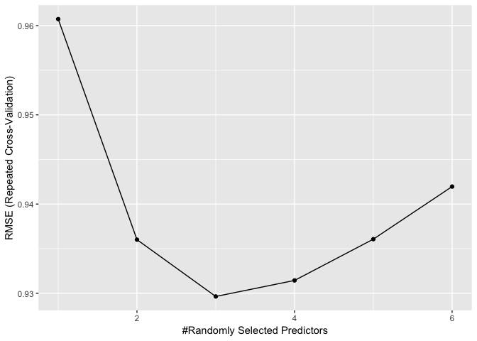
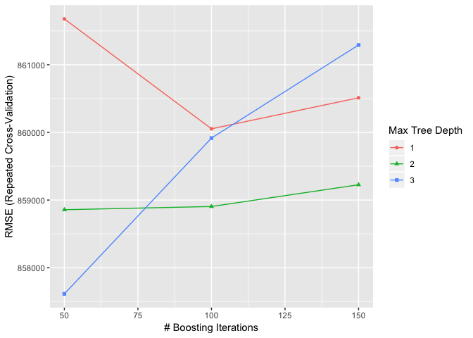
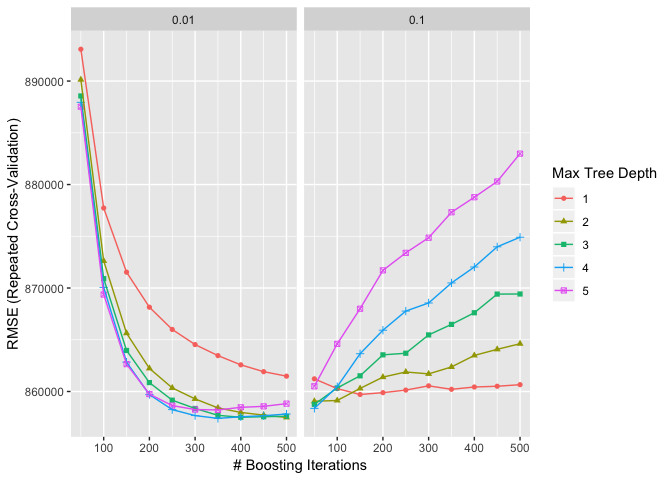

Random Forest
================
Lisa Leung
2019-01-27

Load all libraries
------------------

``` r
library(tidyverse)
```

    ## ── Attaching packages ───────────────────────────────────────────────────────────────────────────────────────────────────────────────────── tidyverse 1.2.1 ──

    ## ✔ ggplot2 3.1.0     ✔ purrr   0.2.4
    ## ✔ tibble  1.4.2     ✔ dplyr   0.7.4
    ## ✔ tidyr   0.8.0     ✔ stringr 1.3.0
    ## ✔ readr   1.1.1     ✔ forcats 0.3.0

    ## ── Conflicts ──────────────────────────────────────────────────────────────────────────────────────────────────────────────────────── tidyverse_conflicts() ──
    ## ✖ dplyr::filter() masks stats::filter()
    ## ✖ dplyr::lag()    masks stats::lag()

``` r
library(caret)
```

    ## Loading required package: lattice

    ## Warning in as.POSIXlt.POSIXct(Sys.time()): unknown timezone 'zone/tz/2018i.
    ## 1.0/zoneinfo/America/Vancouver'

    ## 
    ## Attaching package: 'caret'

    ## The following object is masked from 'package:purrr':
    ## 
    ##     lift

``` r
library(randomForest)
```

    ## randomForest 4.6-14

    ## Type rfNews() to see new features/changes/bug fixes.

    ## 
    ## Attaching package: 'randomForest'

    ## The following object is masked from 'package:dplyr':
    ## 
    ##     combine

    ## The following object is masked from 'package:ggplot2':
    ## 
    ##     margin

``` r
library(quantregForest)
```

    ## Loading required package: RColorBrewer

Purpose
-------

We will conduct random forest to predict the number of purchase made

``` r
# Loading data
dat_User <- read_csv("BlackFriday-User.csv")
```

    ## Parsed with column specification:
    ## cols(
    ##   User_ID = col_integer(),
    ##   Gender = col_character(),
    ##   Age = col_character(),
    ##   Occupation = col_integer(),
    ##   City_Category = col_character(),
    ##   Stay_In_Current_City_Years = col_character(),
    ##   Marital_Status = col_integer(),
    ##   sum_Cat_1 = col_integer(),
    ##   sum_Cat_2 = col_integer(),
    ##   sum_Cat_3 = col_integer(),
    ##   sum_Purchase = col_integer()
    ## )

``` r
dat_User <- dat_User[,!colnames(dat_User) %in% c("X1", "User_ID")]
dat_User$Occupation <- as.factor(dat_User$Occupation) #converting to a factor


# Train and Test data
set.seed(10)
num <- round(nrow(dat_User)/2)
vec_Train <- sample(1:nrow(dat_User),size = num)

dat_Train <- dat_User[vec_Train,]
dat_Test <- dat_User[-vec_Train,]
```

Multiple Regression
-------------------

Before starting random forest, I want to use a multiple regression as a base model on the data set.

``` r
lm_multiple <- lm(sum_Purchase~Gender+Age+Occupation+City_Category+Stay_In_Current_City_Years + Marital_Status, data=dat_Train)
summary(lm_multiple)
```

    ## 
    ## Call:
    ## lm(formula = sum_Purchase ~ Gender + Age + Occupation + City_Category + 
    ##     Stay_In_Current_City_Years + Marital_Status, data = dat_Train)
    ## 
    ## Residuals:
    ##      Min       1Q   Median       3Q      Max 
    ## -1434983  -509725  -170159   341117  6999167 
    ## 
    ## Coefficients:
    ##                              Estimate Std. Error t value Pr(>|t|)    
    ## (Intercept)                   1072383     146499   7.320 3.19e-13 ***
    ## GenderM                        249011      36553   6.812 1.16e-11 ***
    ## Age18-25                       -69763     133160  -0.524  0.60039    
    ## Age26-35                        72333     134158   0.539  0.58982    
    ## Age36-45                        59456     136647   0.435  0.66352    
    ## Age46-50                        -6973     144062  -0.048  0.96140    
    ## Age51-55                       -81842     144849  -0.565  0.57211    
    ## Age55+                        -213761     149495  -1.430  0.15286    
    ## Occupation1                    -66394      71539  -0.928  0.35344    
    ## Occupation2                   -104740      88510  -1.183  0.23676    
    ## Occupation3                    172870     100072   1.727  0.08419 .  
    ## Occupation4                     48041      68824   0.698  0.48522    
    ## Occupation5                    107415     125510   0.856  0.39217    
    ## Occupation6                     72273      96654   0.748  0.45467    
    ## Occupation7                    -38887      66260  -0.587  0.55732    
    ## Occupation8                    -26798     252553  -0.106  0.91550    
    ## Occupation9                    -39497     140819  -0.280  0.77913    
    ## Occupation10                   -95587     142818  -0.669  0.50336    
    ## Occupation11                  -175312     110762  -1.583  0.11358    
    ## Occupation12                  -217535      79287  -2.744  0.00611 ** 
    ## Occupation13                  -118280     122195  -0.968  0.33315    
    ## Occupation14                  -101667      83896  -1.212  0.22568    
    ## Occupation15                  -111269     108275  -1.028  0.30420    
    ## Occupation16                   218549      96696   2.260  0.02388 *  
    ## Occupation17                  -102678      71320  -1.440  0.15007    
    ## Occupation18                   108994     152509   0.715  0.47487    
    ## Occupation19                   203884     146139   1.395  0.16308    
    ## Occupation20                   200335      88793   2.256  0.02413 *  
    ## City_CategoryB                 -76875      48104  -1.598  0.11013    
    ## City_CategoryC                -716852      44024 -16.283  < 2e-16 ***
    ## Stay_In_Current_City_Years1      5134      52224   0.098  0.92169    
    ## Stay_In_Current_City_Years2    -25938      57362  -0.452  0.65117    
    ## Stay_In_Current_City_Years3     86286      60124   1.435  0.15136    
    ## Stay_In_Current_City_Years4+    44459      60554   0.734  0.46288    
    ## Marital_Status                  19718      34468   0.572  0.56732    
    ## ---
    ## Signif. codes:  0 '***' 0.001 '**' 0.01 '*' 0.05 '.' 0.1 ' ' 1
    ## 
    ## Residual standard error: 856900 on 2911 degrees of freedom
    ## Multiple R-squared:  0.1707, Adjusted R-squared:  0.161 
    ## F-statistic: 17.62 on 34 and 2911 DF,  p-value: < 2.2e-16

According to a summary of the multiple linear regression, we see that gender, cities, and occupations play a huge role in total purchases made. I'd like to also see all three cities and check if there are any other differences among the cities.

A couple of measures we will use to compare multiple linear regression to random forests:

Multiple R-squared is squared of correlation between fitted and actual values. Residual standard error is root(mean squared error).

Ultimately, we will also measure the error of predicted rate.

We're going to fit the test data into our multiple linear regression and see how well it predicts.
--------------------------------------------------------------------------------------------------

``` r
# Going to manually calculate the RMSE with the multiple linear regression
vals_predicted <- predict.lm(lm_multiple, newdata = dat_Test)
vals_errors <- dat_Test$sum_Purchase-vals_predicted
RMSE_lm <- sqrt(sum(vals_errors^2)/length(vals_errors))
print(RMSE_lm)
```

    ## [1] 854686.1

``` r
# R squared on predicted values
Rsq_lm <- cor(vals_predicted, dat_Test$sum_Purchase)^2
print(Rsq_lm)
```

    ## [1] 0.1568235

Multiple linear regression seem to do a pretty decent job in terms of predicting values. Later, we will see if we can beat this measure through random forest regression.

### Checking out regressions separated by cities

``` r
dat_A <- dat_Train[dat_Train$City_Category=="A",]
lm_multiple_A <- lm(sum_Purchase~Gender+Age+Occupation+Stay_In_Current_City_Years + Marital_Status, data=dat_A)
summary(lm_multiple_A)
```

    ## 
    ## Call:
    ## lm(formula = sum_Purchase ~ Gender + Age + Occupation + Stay_In_Current_City_Years + 
    ##     Marital_Status, data = dat_A)
    ## 
    ## Residuals:
    ##      Min       1Q   Median       3Q      Max 
    ## -2107804  -890230  -361947   428204  6219546 
    ## 
    ## Coefficients:
    ##                              Estimate Std. Error t value Pr(>|t|)   
    ## (Intercept)                   1374257     665740   2.064  0.03952 * 
    ## GenderM                        365654     140774   2.597  0.00968 **
    ## Age18-25                      -458341     623950  -0.735  0.46295   
    ## Age26-35                      -191673     628891  -0.305  0.76066   
    ## Age36-45                       -95458     640095  -0.149  0.88151   
    ## Age46-50                      -535371     685094  -0.781  0.43491   
    ## Age51-55                      -860872     673265  -1.279  0.20163   
    ## Age55+                       -1111518     706982  -1.572  0.11655   
    ## Occupation1                    -20534     257794  -0.080  0.93655   
    ## Occupation2                   -398309     292008  -1.364  0.17319   
    ## Occupation3                    414583     308820   1.342  0.18007   
    ## Occupation4                    280486     229850   1.220  0.22294   
    ## Occupation5                    599012     479806   1.248  0.21247   
    ## Occupation6                    440427     441600   0.997  0.31909   
    ## Occupation7                    -91370     251564  -0.363  0.71661   
    ## Occupation8                   -372916     984278  -0.379  0.70495   
    ## Occupation9                    241312     633276   0.381  0.70333   
    ## Occupation10                  -307798     634843  -0.485  0.62801   
    ## Occupation11                   -14621     467873  -0.031  0.97508   
    ## Occupation12                  -429695     274279  -1.567  0.11785   
    ## Occupation13                  -369026     719757  -0.513  0.60839   
    ## Occupation14                   -91868     307772  -0.298  0.76545   
    ## Occupation15                    18411     385624   0.048  0.96194   
    ## Occupation16                   111964     448208   0.250  0.80284   
    ## Occupation17                   -15761     294490  -0.054  0.95734   
    ## Occupation18                   866660     701969   1.235  0.21757   
    ## Occupation19                     6112     637565   0.010  0.99235   
    ## Occupation20                   739824     317733   2.328  0.02030 * 
    ## Stay_In_Current_City_Years1   -279050     197984  -1.409  0.15934   
    ## Stay_In_Current_City_Years2   -125472     215003  -0.584  0.55977   
    ## Stay_In_Current_City_Years3     52928     226824   0.233  0.81559   
    ## Stay_In_Current_City_Years4+  -171951     226044  -0.761  0.44721   
    ## Marital_Status                 138698     134209   1.033  0.30191   
    ## ---
    ## Signif. codes:  0 '***' 0.001 '**' 0.01 '*' 0.05 '.' 0.1 ' ' 1
    ## 
    ## Residual standard error: 1346000 on 487 degrees of freedom
    ## Multiple R-squared:  0.1039, Adjusted R-squared:  0.04505 
    ## F-statistic: 1.765 on 32 and 487 DF,  p-value: 0.006837

``` r
dat_B <- dat_Train[dat_Train$City_Category=="B",]
lm_multiple_B <- lm(sum_Purchase~Gender+Age+Occupation+Stay_In_Current_City_Years + Marital_Status, data=dat_B)
summary(lm_multiple_B)
```

    ## 
    ## Call:
    ## lm(formula = sum_Purchase ~ Gender + Age + Occupation + Stay_In_Current_City_Years + 
    ##     Marital_Status, data = dat_B)
    ## 
    ## Residuals:
    ##      Min       1Q   Median       3Q      Max 
    ## -1748570  -769346  -266549   596366  3491871 
    ## 
    ## Coefficients:
    ##                              Estimate Std. Error t value Pr(>|t|)    
    ## (Intercept)                   1019963     316338   3.224  0.00131 ** 
    ## GenderM                        398022      81424   4.888 1.23e-06 ***
    ## Age18-25                      -207880     295816  -0.703  0.48242    
    ## Age26-35                       -71512     301131  -0.237  0.81235    
    ## Age36-45                      -171597     309016  -0.555  0.57884    
    ## Age46-50                      -122898     328701  -0.374  0.70858    
    ## Age51-55                      -155208     330137  -0.470  0.63839    
    ## Age55+                        -375100     364983  -1.028  0.30439    
    ## Occupation1                   -143570     162306  -0.885  0.37665    
    ## Occupation2                   -111444     196634  -0.567  0.57103    
    ## Occupation3                    274698     250684   1.096  0.27349    
    ## Occupation4                   -140264     154233  -0.909  0.36339    
    ## Occupation5                     71931     244876   0.294  0.76903    
    ## Occupation6                    202969     200125   1.014  0.31078    
    ## Occupation7                     59986     160070   0.375  0.70795    
    ## Occupation8                   1490329    1049467   1.420  0.15597    
    ## Occupation9                   -124489     348624  -0.357  0.72112    
    ## Occupation10                  -465536     306723  -1.518  0.12946    
    ## Occupation11                  -303262     249856  -1.214  0.22520    
    ## Occupation12                  -355675     179108  -1.986  0.04739 *  
    ## Occupation13                  -690879     302117  -2.287  0.02246 *  
    ## Occupation14                  -196311     195122  -1.006  0.31467    
    ## Occupation15                  -240730     260081  -0.926  0.35493    
    ## Occupation16                   466246     202131   2.307  0.02132 *  
    ## Occupation17                  -316390     161910  -1.954  0.05103 .  
    ## Occupation18                   155743     409838   0.380  0.70404    
    ## Occupation19                   264608     298636   0.886  0.37585    
    ## Occupation20                    77763     186850   0.416  0.67739    
    ## Stay_In_Current_City_Years1    157780     118074   1.336  0.18183    
    ## Stay_In_Current_City_Years2     31672     130772   0.242  0.80869    
    ## Stay_In_Current_City_Years3    239728     134665   1.780  0.07542 .  
    ## Stay_In_Current_City_Years4+   151669     139516   1.087  0.27731    
    ## Marital_Status                 -35284      78918  -0.447  0.65492    
    ## ---
    ## Signif. codes:  0 '***' 0.001 '**' 0.01 '*' 0.05 '.' 0.1 ' ' 1
    ## 
    ## Residual standard error: 1032000 on 812 degrees of freedom
    ## Multiple R-squared:  0.08194,    Adjusted R-squared:  0.04576 
    ## F-statistic: 2.265 on 32 and 812 DF,  p-value: 9.656e-05

``` r
dat_C <- dat_Train[dat_Train$City_Category=="C",]
lm_multiple_C <- lm(sum_Purchase~Gender+Age+Occupation+Stay_In_Current_City_Years + Marital_Status, data=dat_C)
summary(lm_multiple_C)
```

    ## 
    ## Call:
    ## lm(formula = sum_Purchase ~ Gender + Age + Occupation + Stay_In_Current_City_Years + 
    ##     Marital_Status, data = dat_C)
    ## 
    ## Residuals:
    ##     Min      1Q  Median      3Q     Max 
    ## -675342 -320358 -135171  222434 1839772 
    ## 
    ## Coefficients:
    ##                              Estimate Std. Error t value Pr(>|t|)    
    ## (Intercept)                    306989      94137   3.261  0.00113 ** 
    ## GenderM                        123955      25475   4.866 1.26e-06 ***
    ## Age18-25                       101138      88654   1.141  0.25412    
    ## Age26-35                       139913      88595   1.579  0.11449    
    ## Age36-45                       133140      89710   1.484  0.13798    
    ## Age46-50                       137079      94245   1.454  0.14601    
    ## Age51-55                       104415      95028   1.099  0.27203    
    ## Age55+                          19824      96142   0.206  0.83667    
    ## Occupation1                    -15668      50123  -0.313  0.75463    
    ## Occupation2                     45248      65396   0.692  0.48910    
    ## Occupation3                     30748      71219   0.432  0.66599    
    ## Occupation4                     19701      50208   0.392  0.69483    
    ## Occupation5                    -78600      95968  -0.819  0.41290    
    ## Occupation6                   -104281      67632  -1.542  0.12330    
    ## Occupation7                    -25864      44684  -0.579  0.56279    
    ## Occupation8                     -2792     148223  -0.019  0.98497    
    ## Occupation9                    -77648      89727  -0.865  0.38696    
    ## Occupation10                    94669      96822   0.978  0.32835    
    ## Occupation11                  -101264      74466  -1.360  0.17407    
    ## Occupation12                   -17154      56443  -0.304  0.76122    
    ## Occupation13                    14177      75842   0.187  0.85175    
    ## Occupation14                   -49006      57585  -0.851  0.39488    
    ## Occupation15                   -66388      73655  -0.901  0.36755    
    ## Occupation16                    80801      66803   1.210  0.22663    
    ## Occupation17                     4846      48321   0.100  0.92013    
    ## Occupation18                    17507      94189   0.186  0.85257    
    ## Occupation19                   165436     102980   1.606  0.10837    
    ## Occupation20                     1393      65963   0.021  0.98316    
    ## Stay_In_Current_City_Years1     29833      36318   0.821  0.41152    
    ## Stay_In_Current_City_Years2     -8691      39828  -0.218  0.82728    
    ## Stay_In_Current_City_Years3     32357      41988   0.771  0.44105    
    ## Stay_In_Current_City_Years4+    60611      41957   1.445  0.14877    
    ## Marital_Status                  10770      23818   0.452  0.65119    
    ## ---
    ## Signif. codes:  0 '***' 0.001 '**' 0.01 '*' 0.05 '.' 0.1 ' ' 1
    ## 
    ## Residual standard error: 431900 on 1548 degrees of freedom
    ## Multiple R-squared:  0.0356, Adjusted R-squared:  0.01566 
    ## F-statistic: 1.786 on 32 and 1548 DF,  p-value: 0.004612

Interestingly, the spendings seem to affect most on city A and city B. We see that occupation 20 seem to spend $739,824 more on average.

Let's start the random forest!
==============================

We will use train to tune parameters. The first train will be optimizing the randomly selected predictors
---------------------------------------------------------------------------------------------------------

``` r
# Setting parameters on mtry tuning
control <- trainControl( #trainControl is used to alter the default methods in train function
  method="repeatedcv", # K-fold CV; by default, it uses bootstrap sampling
  number=5, # 3 repeats of 5-fold CV
  repeats=3) 

metric <- "RMSE" #A string that specifies what summary metric will be used to select the optimal model. By default, possible values are "RMSE" and "Rsquared" for regression and "Accuracy" and "Kappa" for classification. 
mtry <- 1:6 # number of variables to use per tree; note that it is usually the best on square root of number of variables. Will try a sequence 
tunegrid <- expand.grid(.mtry=mtry) # Change this parameter to change the candidates for tuning parameters
preProc = c("center", "scale")

# Running the random forest

seed <- 10
set.seed(seed)
rf_simple <- train(
  sum_Purchase~Gender+Age+Occupation+City_Category+Stay_In_Current_City_Years + Marital_Status, data=dat_Train, # model
  method = 'rf', #using random forest to train. FYI, I've accidentally used qrf which is supposed to look at high dimensional data. It was usedto estimate conditional quantiles - we are not using that. Big oops!
  metric=metric, #using RMSE (root mean square error) to define my loss function
  tuneGrid=tunegrid, # Tuning parameters uses mytry (randomly selected predictors);
  trControl=control, # method="repeatedcv",number=10, repeats=3
  preProc=preProc) #centering and scaling the predictors
print(rf_simple)
```

    ## Random Forest 
    ## 
    ## 2946 samples
    ##    6 predictor
    ## 
    ## Pre-processing: centered (34), scaled (34) 
    ## Resampling: Cross-Validated (5 fold, repeated 3 times) 
    ## Summary of sample sizes: 2356, 2355, 2358, 2358, 2357, 2356, ... 
    ## Resampling results across tuning parameters:
    ## 
    ##   mtry  RMSE      Rsquared   MAE     
    ##   1     901916.7  0.1406302  632096.6
    ##   2     874779.7  0.1455999  612180.2
    ##   3     867031.0  0.1437728  605229.1
    ##   4     867846.6  0.1386579  604603.8
    ##   5     872287.0  0.1320574  605985.3
    ##   6     878476.6  0.1248917  608188.8
    ## 
    ## RMSE was used to select the optimal model using the smallest value.
    ## The final value used for the model was mtry = 3.

``` r
ggplot(rf_simple)
```



``` r
# Running the gradient boosting random forest; keeping everything else the same 

seed <- 10
set.seed(seed)
rf_gbm <- train(
  sum_Purchase~Gender+Age+Occupation+City_Category+Stay_In_Current_City_Years + Marital_Status, data=dat_Train, # model
  method = 'gbm', #gradient boosting method; on each 
  metric=metric, #using RMSE (root mean square error) to define my loss function
  trControl=control, # method="repeatedcv",number=10, repeats=3
  preProc=preProc) #centering and scaling the predictors
```

    ## Iter   TrainDeviance   ValidDeviance   StepSize   Improve
    ##      1 879668671079.2488             nan     0.1000 22795461292.5316
    ##      2 861073501241.4706             nan     0.1000 18316793780.8707
    ##      3 845262517562.9191             nan     0.1000 14836632108.6290
    ##      4 833210654974.6345             nan     0.1000 11824248105.6992
    ##      5 822723861005.1752             nan     0.1000 9153961030.9202
    ##      6 814449892383.7970             nan     0.1000 7463154307.1619
    ##      7 808720136919.4727             nan     0.1000 6055522493.3465
    ##      8 803238646430.0803             nan     0.1000 4425520330.9047
    ##      9 798737050408.3486             nan     0.1000 3727311839.8632
    ##     10 795566569260.4025             nan     0.1000 3008192019.1424
    ##     20 779320896809.6479             nan     0.1000 1123115739.1343
    ##     40 765546663730.0580             nan     0.1000 -338585317.7283
    ##     60 759431331127.2889             nan     0.1000 -344951021.9313
    ##     80 755281977149.5469             nan     0.1000 -373261874.6061
    ##    100 753759645854.2404             nan     0.1000 -426394203.6793
    ##    120 751938976650.0165             nan     0.1000 -339690142.6656
    ##    140 750789338021.9434             nan     0.1000 -491306788.0135
    ##    150 750508718039.6896             nan     0.1000 -609676407.1950
    ## 
    ## Iter   TrainDeviance   ValidDeviance   StepSize   Improve
    ##      1 877466408795.2394             nan     0.1000 25481263264.0960
    ##      2 858702213277.1356             nan     0.1000 19481089746.2689
    ##      3 841467030915.6638             nan     0.1000 17248558491.1840
    ##      4 826919918744.9832             nan     0.1000 12251274255.1310
    ##      5 815162529345.6909             nan     0.1000 10928444495.1823
    ##      6 806067236096.9686             nan     0.1000 8991972059.7843
    ##      7 798859447778.6138             nan     0.1000 7168159810.5445
    ##      8 793198804585.6871             nan     0.1000 5405725578.4537
    ##      9 787574462158.1515             nan     0.1000 4196791203.1537
    ##     10 782276345019.5939             nan     0.1000 2569031572.3612
    ##     20 762196460913.3408             nan     0.1000 1116057763.9222
    ##     40 746969207027.1300             nan     0.1000 -749170996.2007
    ##     60 738865039745.3577             nan     0.1000 -1129176183.2878
    ##     80 734994239045.3376             nan     0.1000 -505398719.1799
    ##    100 731872725381.7659             nan     0.1000 -873906388.3573
    ##    120 729721555345.6489             nan     0.1000 -1384945428.7781
    ##    140 728047797300.1018             nan     0.1000 -796145816.7916
    ##    150 726565753361.5608             nan     0.1000 -595087416.3776
    ## 
    ## Iter   TrainDeviance   ValidDeviance   StepSize   Improve
    ##      1 877576926334.1652             nan     0.1000 23140029768.4304
    ##      2 855226235647.5880             nan     0.1000 21494652606.7799
    ##      3 837749080125.4000             nan     0.1000 17580286171.2250
    ##      4 823686641606.0773             nan     0.1000 12189464872.6781
    ##      5 810628829191.2753             nan     0.1000 12234291299.8462
    ##      6 800411604231.0393             nan     0.1000 9105945543.4197
    ##      7 790611514644.2750             nan     0.1000 7416914891.1979
    ##      8 783273499104.4103             nan     0.1000 5313074956.8104
    ##      9 778137507512.8412             nan     0.1000 3732990048.8590
    ##     10 772791958569.7212             nan     0.1000 1961831096.4111
    ##     20 750213281723.2657             nan     0.1000 -1034770565.3533
    ##     40 734934882071.9604             nan     0.1000 -252714696.1013
    ##     60 726450757785.4237             nan     0.1000 -854249569.7872
    ##     80 722125312444.7408             nan     0.1000 -775353005.0923
    ##    100 716099253429.1335             nan     0.1000 -1184881061.5255
    ##    120 711776658801.5046             nan     0.1000 -856937566.9306
    ##    140 709279693420.5491             nan     0.1000 -1077473157.0227
    ##    150 707638121862.2280             nan     0.1000 -532827620.4432
    ## 
    ## Iter   TrainDeviance   ValidDeviance   StepSize   Improve
    ##      1 822758684340.9540             nan     0.1000 21632258815.0121
    ##      2 805660461314.6613             nan     0.1000 17527130096.1359
    ##      3 792069568348.7189             nan     0.1000 14162560281.3895
    ##      4 780666484323.2994             nan     0.1000 11663862712.5239
    ##      5 771255218344.5938             nan     0.1000 9570417587.7406
    ##      6 763023779200.7717             nan     0.1000 7524838981.9059
    ##      7 758128972513.0420             nan     0.1000 5820066073.0917
    ##      8 753063097202.2268             nan     0.1000 5243272803.6627
    ##      9 748347708870.2056             nan     0.1000 4106944052.3476
    ##     10 745534900374.6240             nan     0.1000 3278543782.7683
    ##     20 729128367642.4979             nan     0.1000 563321632.4079
    ##     40 715854771646.3654             nan     0.1000 -338745264.0779
    ##     60 708680391631.2664             nan     0.1000 -123327905.8272
    ##     80 705843246929.5831             nan     0.1000 -505780818.9088
    ##    100 703561053176.6156             nan     0.1000 -212697342.2333
    ##    120 702754035941.0963             nan     0.1000 -187822208.3582
    ##    140 701728385728.6276             nan     0.1000 -512899099.0315
    ##    150 701161560021.2317             nan     0.1000 -157616510.4893
    ## 
    ## Iter   TrainDeviance   ValidDeviance   StepSize   Improve
    ##      1 821643068803.6604             nan     0.1000 22281252716.2071
    ##      2 802513688915.2471             nan     0.1000 16466993977.1156
    ##      3 786732031752.2411             nan     0.1000 13716506233.3863
    ##      4 772342492924.0823             nan     0.1000 13193695415.0884
    ##      5 763777849380.7133             nan     0.1000 8559497760.5511
    ##      6 754268708704.6218             nan     0.1000 9088979180.1114
    ##      7 746444263745.7765             nan     0.1000 6987767546.6914
    ##      8 741088601268.3438             nan     0.1000 4760159940.0862
    ##      9 736832663810.5382             nan     0.1000 3101431251.3716
    ##     10 732232311513.1725             nan     0.1000 4429851123.9441
    ##     20 710684679455.9952             nan     0.1000 702277413.7646
    ##     40 694949381339.0543             nan     0.1000 -566464339.8649
    ##     60 689713665093.7771             nan     0.1000 -265647540.2003
    ##     80 685406848674.1510             nan     0.1000 -719492643.2499
    ##    100 681994474724.2836             nan     0.1000 -381876149.5677
    ##    120 678578884632.7268             nan     0.1000 -334193404.5150
    ##    140 676604325687.6071             nan     0.1000 -665936507.6977
    ##    150 675711905323.3005             nan     0.1000 -444827777.3343
    ## 
    ## Iter   TrainDeviance   ValidDeviance   StepSize   Improve
    ##      1 820165393561.9777             nan     0.1000 24859193495.7669
    ##      2 799953445644.9728             nan     0.1000 20116105822.0383
    ##      3 783643332343.5746             nan     0.1000 11898395637.7210
    ##      4 771908688228.6982             nan     0.1000 10309319519.7033
    ##      5 759891369671.6655             nan     0.1000 11315820320.5923
    ##      6 749504944329.9070             nan     0.1000 8231031982.6009
    ##      7 740426106500.0780             nan     0.1000 7524589824.8265
    ##      8 733883034622.6321             nan     0.1000 6296268026.2871
    ##      9 727556574500.3969             nan     0.1000 4662177725.4690
    ##     10 722836764994.7186             nan     0.1000 3852702951.5078
    ##     20 697983578095.7540             nan     0.1000 -344570029.3636
    ##     40 681149898052.0217             nan     0.1000 -986383166.2743
    ##     60 673384232978.4070             nan     0.1000 -1214194780.0642
    ##     80 668947307981.7235             nan     0.1000 -358031769.4906
    ##    100 664465652829.4116             nan     0.1000 -194231989.4987
    ##    120 660430007906.9231             nan     0.1000 -448495769.3989
    ##    140 658137883659.7350             nan     0.1000 -1987154559.4978
    ##    150 656986758274.5157             nan     0.1000 -459560333.3676
    ## 
    ## Iter   TrainDeviance   ValidDeviance   StepSize   Improve
    ##      1 874018077797.9891             nan     0.1000 23562720155.4242
    ##      2 853786989967.2407             nan     0.1000 18902686415.6796
    ##      3 837712757409.1600             nan     0.1000 14855992534.1513
    ##      4 825461237035.1622             nan     0.1000 12230740566.2563
    ##      5 815143624994.0597             nan     0.1000 9621015589.1363
    ##      6 808214085047.7462             nan     0.1000 7825827780.9886
    ##      7 801543697888.5492             nan     0.1000 6549692325.7260
    ##      8 797106719223.4418             nan     0.1000 5234019902.7690
    ##      9 792721891036.5585             nan     0.1000 4462594776.7891
    ##     10 788908343589.3657             nan     0.1000 3554342628.2694
    ##     20 772234824998.1082             nan     0.1000 619151402.8328
    ##     40 760272467093.5801             nan     0.1000 421424846.8454
    ##     60 754587722533.0947             nan     0.1000 -160261451.9794
    ##     80 750783767710.6393             nan     0.1000 -395561413.9196
    ##    100 748400013961.4716             nan     0.1000 -769276564.4130
    ##    120 747167969584.9375             nan     0.1000 -76868329.1979
    ##    140 746366847490.9713             nan     0.1000 -854054612.0945
    ##    150 745858187922.1173             nan     0.1000 -220255842.5044
    ## 
    ## Iter   TrainDeviance   ValidDeviance   StepSize   Improve
    ##      1 869249519410.0563             nan     0.1000 23814295158.6447
    ##      2 850643706242.5687             nan     0.1000 18908513020.0709
    ##      3 834271221369.5614             nan     0.1000 15048755387.8581
    ##      4 823045884579.0793             nan     0.1000 11314052225.9151
    ##      5 811498255404.0173             nan     0.1000 11488615526.2481
    ##      6 802278232690.7983             nan     0.1000 9520006829.1573
    ##      7 794077584522.2969             nan     0.1000 6619798827.9093
    ##      8 787386355237.5547             nan     0.1000 5879420535.1581
    ##      9 781973670762.9457             nan     0.1000 2983176438.1394
    ##     10 777957507670.7412             nan     0.1000 4443127077.3543
    ##     20 754603829692.4797             nan     0.1000 488373181.3389
    ##     40 739729132730.8004             nan     0.1000 -58568210.4856
    ##     60 731745990360.5927             nan     0.1000 -202925866.5758
    ##     80 728136103637.4539             nan     0.1000 -614999455.0764
    ##    100 723109026008.4326             nan     0.1000 -576674271.6043
    ##    120 719656724755.8892             nan     0.1000 -1077094493.5566
    ##    140 716786659627.4834             nan     0.1000 -453943482.4362
    ##    150 715464746075.9320             nan     0.1000 -621765218.3886
    ## 
    ## Iter   TrainDeviance   ValidDeviance   StepSize   Improve
    ##      1 868834564453.4346             nan     0.1000 26098686724.1301
    ##      2 845406191159.5938             nan     0.1000 19152668538.4154
    ##      3 829040777207.4308             nan     0.1000 16309529933.4769
    ##      4 812786363175.9359             nan     0.1000 11419682271.2761
    ##      5 801166735751.6522             nan     0.1000 9506169346.0011
    ##      6 791629239400.1794             nan     0.1000 7248420796.5737
    ##      7 782935813121.4109             nan     0.1000 7669486465.6592
    ##      8 777054224917.0365             nan     0.1000 4455466308.7815
    ##      9 772409981844.7976             nan     0.1000 3908279740.3906
    ##     10 767922330981.8944             nan     0.1000 3146814012.7416
    ##     20 741873822301.4280             nan     0.1000 421254130.1330
    ##     40 725066261210.3606             nan     0.1000 -845632634.7431
    ##     60 717771146292.2323             nan     0.1000 -862429224.7677
    ##     80 710000489321.7487             nan     0.1000 -715597580.5970
    ##    100 705781535514.6364             nan     0.1000 -905411844.8850
    ##    120 701459704851.7023             nan     0.1000 -1780121947.2881
    ##    140 697222539133.8678             nan     0.1000 -1438817115.3052
    ##    150 695772321241.5204             nan     0.1000 -719780680.8787
    ## 
    ## Iter   TrainDeviance   ValidDeviance   StepSize   Improve
    ##      1 851025780559.6115             nan     0.1000 21960675509.8273
    ##      2 832353578076.6030             nan     0.1000 17912974747.9819
    ##      3 819061406287.6500             nan     0.1000 13853789593.5817
    ##      4 807661636234.7352             nan     0.1000 11854118259.1921
    ##      5 798351999895.3855             nan     0.1000 9753116743.9398
    ##      6 790788986703.0364             nan     0.1000 7887904314.8247
    ##      7 784226630373.6425             nan     0.1000 6429289522.4736
    ##      8 778921811412.6145             nan     0.1000 5240804028.6219
    ##      9 775182184982.7070             nan     0.1000 3958786269.9959
    ##     10 770690501302.4325             nan     0.1000 2902468279.9668
    ##     20 754296360969.7914             nan     0.1000 886104017.9699
    ##     40 742271307507.1652             nan     0.1000 209214447.7361
    ##     60 736066171309.7317             nan     0.1000 8377456.4086
    ##     80 732520536358.9880             nan     0.1000 -206622550.0857
    ##    100 730368901949.2208             nan     0.1000 -162890305.8874
    ##    120 729137997099.2507             nan     0.1000 -239695103.2193
    ##    140 728143741680.3047             nan     0.1000 -383410031.3620
    ##    150 727814614525.3665             nan     0.1000 -445028807.9374
    ## 
    ## Iter   TrainDeviance   ValidDeviance   StepSize   Improve
    ##      1 848555740801.9418             nan     0.1000 23912943487.5943
    ##      2 828095026240.7339             nan     0.1000 18611614810.4521
    ##      3 811560303561.0919             nan     0.1000 14718335941.2670
    ##      4 797894586261.8285             nan     0.1000 11973798490.6149
    ##      5 789561657722.2070             nan     0.1000 8087107861.5652
    ##      6 780710840705.2532             nan     0.1000 8387100245.4876
    ##      7 773659696327.1212             nan     0.1000 7178411066.9106
    ##      8 766439639559.0426             nan     0.1000 5351274941.3006
    ##      9 761327166862.7539             nan     0.1000 3767229876.7581
    ##     10 756748638398.1503             nan     0.1000 3460186268.9469
    ##     20 737624103965.4076             nan     0.1000 159252635.9182
    ##     40 725328259875.5165             nan     0.1000 -959342799.7870
    ##     60 717737030583.4832             nan     0.1000 -134523364.5408
    ##     80 712952416472.7032             nan     0.1000 -476076936.3702
    ##    100 709567650742.8832             nan     0.1000 -971223967.5179
    ##    120 705999074143.0758             nan     0.1000 -1021132487.8977
    ##    140 702758011245.3022             nan     0.1000 -296286216.3586
    ##    150 701873863570.7051             nan     0.1000 -1310027144.2734
    ## 
    ## Iter   TrainDeviance   ValidDeviance   StepSize   Improve
    ##      1 847259352146.8710             nan     0.1000 21600430887.0428
    ##      2 828367439755.2794             nan     0.1000 19813233977.7470
    ##      3 809235912688.7661             nan     0.1000 13843377909.3548
    ##      4 795293096610.6666             nan     0.1000 13307394488.8903
    ##      5 782718137581.0040             nan     0.1000 9519875215.0572
    ##      6 773213674108.4811             nan     0.1000 7662854695.3195
    ##      7 765774675548.5306             nan     0.1000 7225453958.4576
    ##      8 760597525999.9141             nan     0.1000 4182911206.6627
    ##      9 755912614019.0516             nan     0.1000 4703060868.3402
    ##     10 751601153727.9429             nan     0.1000 3745445357.4528
    ##     20 727959379285.6956             nan     0.1000 623438232.1138
    ##     40 709976625782.1331             nan     0.1000 -352433516.3056
    ##     60 702758248906.8250             nan     0.1000 -738489535.1035
    ##     80 697800096066.5355             nan     0.1000 -675365231.8897
    ##    100 694090451358.8329             nan     0.1000 -539915796.8812
    ##    120 689704397661.2764             nan     0.1000 -1433684931.8480
    ##    140 686523883601.1105             nan     0.1000 -1306169913.2028
    ##    150 684805699507.5740             nan     0.1000 -547973584.5851
    ## 
    ## Iter   TrainDeviance   ValidDeviance   StepSize   Improve
    ##      1 832683120033.7729             nan     0.1000 22185662817.4209
    ##      2 814345267712.0239             nan     0.1000 17973661096.6865
    ##      3 798875199415.1493             nan     0.1000 14380677720.3909
    ##      4 787529506991.9727             nan     0.1000 11703656228.2371
    ##      5 778431243341.3475             nan     0.1000 9503884674.0398
    ##      6 770944695327.7571             nan     0.1000 7716319277.2109
    ##      7 765346089514.4421             nan     0.1000 6291117051.9613
    ##      8 759957815244.3154             nan     0.1000 5237321412.3695
    ##      9 755937130969.6633             nan     0.1000 4256755117.1459
    ##     10 752363577673.7609             nan     0.1000 3491052605.4024
    ##     20 734661438411.5514             nan     0.1000 -192603474.0979
    ##     40 722342099671.1898             nan     0.1000 -66712788.4834
    ##     60 715562515667.5564             nan     0.1000 -187963274.5034
    ##     80 711246170266.2496             nan     0.1000 -43775214.2069
    ##    100 708447175923.1709             nan     0.1000 -112843738.3302
    ##    120 706594842710.7131             nan     0.1000 -493536834.9633
    ##    140 705989801620.0320             nan     0.1000 -260106441.5573
    ##    150 705455922903.6738             nan     0.1000 -361866819.2196
    ## 
    ## Iter   TrainDeviance   ValidDeviance   StepSize   Improve
    ##      1 832580540190.8030             nan     0.1000 22583225421.4095
    ##      2 809830812931.9138             nan     0.1000 20180561951.9007
    ##      3 794407154038.4713             nan     0.1000 14974360856.5352
    ##      4 782235376448.6533             nan     0.1000 13629816978.1876
    ##      5 771309085604.6237             nan     0.1000 10194468911.9302
    ##      6 760855331151.4114             nan     0.1000 9299854148.9572
    ##      7 753970644967.8110             nan     0.1000 7479945750.4217
    ##      8 747515371865.5485             nan     0.1000 5259518460.6715
    ##      9 743146743759.7251             nan     0.1000 4153603678.8230
    ##     10 739025441935.1178             nan     0.1000 3582826181.8009
    ##     20 717397629099.4020             nan     0.1000 760089102.9898
    ##     40 702308818804.4799             nan     0.1000 179911504.2063
    ##     60 695333035880.1799             nan     0.1000 -244437080.7176
    ##     80 690432619668.5757             nan     0.1000 -639773683.8870
    ##    100 686494164426.1887             nan     0.1000 -650798511.1233
    ##    120 683959383197.9392             nan     0.1000 -609172940.0914
    ##    140 681739781944.1807             nan     0.1000 -547155821.2233
    ##    150 680571974784.6975             nan     0.1000 -988999528.8956
    ## 
    ## Iter   TrainDeviance   ValidDeviance   StepSize   Improve
    ##      1 830257544576.9414             nan     0.1000 23632270999.8235
    ##      2 805442706239.7002             nan     0.1000 21023205620.9763
    ##      3 787533177832.2263             nan     0.1000 16985604898.5554
    ##      4 775753901531.8958             nan     0.1000 12220834038.1405
    ##      5 765415226055.5120             nan     0.1000 9701133095.7015
    ##      6 754493062190.7925             nan     0.1000 9121537870.9688
    ##      7 747047132523.4626             nan     0.1000 6891402492.9905
    ##      8 741388173416.5830             nan     0.1000 4792547827.5095
    ##      9 735288002895.0233             nan     0.1000 3495129182.0378
    ##     10 729384088836.0012             nan     0.1000 3650624013.8546
    ##     20 707815081694.4198             nan     0.1000 -434264288.6501
    ##     40 691221570202.4535             nan     0.1000 -773171044.0178
    ##     60 683963463865.6967             nan     0.1000 -1512247263.5816
    ##     80 677297180742.9916             nan     0.1000 -804402591.3665
    ##    100 672363020045.8224             nan     0.1000 -323439835.4737
    ##    120 669389190132.9664             nan     0.1000 -347523970.3259
    ##    140 665057322671.1847             nan     0.1000 -970557044.1217
    ##    150 663867843741.5079             nan     0.1000 -1225299397.4361
    ## 
    ## Iter   TrainDeviance   ValidDeviance   StepSize   Improve
    ##      1 843040816435.2694             nan     0.1000 20177459494.8925
    ##      2 827851162413.7711             nan     0.1000 16546047481.7634
    ##      3 812479331247.4941             nan     0.1000 12886332120.6171
    ##      4 800010255964.7330             nan     0.1000 9794144482.9849
    ##      5 791376204653.9977             nan     0.1000 8407554948.5338
    ##      6 783913825977.9265             nan     0.1000 6553806027.1461
    ##      7 778057618606.0072             nan     0.1000 5159955226.8632
    ##      8 774472758464.9866             nan     0.1000 4168397912.4991
    ##      9 771065682862.5032             nan     0.1000 3555765128.6264
    ##     10 768250834696.3816             nan     0.1000 2897838237.5134
    ##     20 752787176122.6945             nan     0.1000 1073595184.5513
    ##     40 741866006210.3584             nan     0.1000 -156920386.1012
    ##     60 735221312771.8333             nan     0.1000 -139611470.1306
    ##     80 731859926898.0931             nan     0.1000 -394020954.8069
    ##    100 730359198496.4369             nan     0.1000 -401216642.5936
    ##    120 728989740370.5229             nan     0.1000 -222156348.5318
    ##    140 727899787192.5627             nan     0.1000 -596649297.3048
    ##    150 727503725089.3622             nan     0.1000 -222451527.1821
    ## 
    ## Iter   TrainDeviance   ValidDeviance   StepSize   Improve
    ##      1 845350852803.5411             nan     0.1000 21138034227.2565
    ##      2 826715623147.1570             nan     0.1000 16703348527.7434
    ##      3 812517810423.5966             nan     0.1000 14864296598.4089
    ##      4 799022213467.3618             nan     0.1000 13260304416.1769
    ##      5 789526408636.6458             nan     0.1000 9629059797.9918
    ##      6 778702678911.8035             nan     0.1000 8050274395.0067
    ##      7 772667008033.4775             nan     0.1000 5382513230.4454
    ##      8 766035390446.4661             nan     0.1000 5347229743.3437
    ##      9 760347503556.4901             nan     0.1000 3909545463.0835
    ##     10 756233554408.0420             nan     0.1000 3538803925.3114
    ##     20 738597979219.2897             nan     0.1000 263391168.7915
    ##     40 724588271383.8743             nan     0.1000 365288554.0758
    ##     60 718196916688.6593             nan     0.1000 -196261323.6039
    ##     80 713350626381.8921             nan     0.1000 -269333704.8583
    ##    100 709893621527.4688             nan     0.1000 -1255416201.7723
    ##    120 706615883229.6876             nan     0.1000 -438695423.4585
    ##    140 703510197225.2725             nan     0.1000 -694593906.0887
    ##    150 702849819090.8873             nan     0.1000 -342249286.7838
    ## 
    ## Iter   TrainDeviance   ValidDeviance   StepSize   Improve
    ##      1 841222890878.8158             nan     0.1000 22303014532.0144
    ##      2 824724676351.9424             nan     0.1000 16010591443.4934
    ##      3 807253082676.6790             nan     0.1000 15485413089.1455
    ##      4 795155879199.9930             nan     0.1000 10351824591.8186
    ##      5 785254332406.3102             nan     0.1000 10252165844.7929
    ##      6 775687179545.1979             nan     0.1000 6411696230.1173
    ##      7 767033463444.2083             nan     0.1000 6544743694.0703
    ##      8 760979247009.0464             nan     0.1000 4130663460.6233
    ##      9 756484286753.5282             nan     0.1000 4971725383.5747
    ##     10 751603265483.6213             nan     0.1000 4041085213.1143
    ##     20 728693421220.8678             nan     0.1000 -385125690.6601
    ##     40 712901025294.2050             nan     0.1000 -498270610.3445
    ##     60 702173042347.1403             nan     0.1000 -777293236.4906
    ##     80 698328705529.8914             nan     0.1000 -863587894.2573
    ##    100 694262743543.0023             nan     0.1000 -1468021249.7153
    ##    120 689828074632.9930             nan     0.1000 -916556349.6900
    ##    140 686431329699.8842             nan     0.1000 -495936230.7566
    ##    150 685362791943.4816             nan     0.1000 -864373128.3373
    ## 
    ## Iter   TrainDeviance   ValidDeviance   StepSize   Improve
    ##      1 840079704385.3773             nan     0.1000 21643585127.3750
    ##      2 823261894269.9600             nan     0.1000 17571138901.8449
    ##      3 809463528259.9458             nan     0.1000 14440990478.2507
    ##      4 797945676874.3798             nan     0.1000 11758161756.2924
    ##      5 788467188347.8352             nan     0.1000 9534054909.6205
    ##      6 780740562287.5300             nan     0.1000 7818933115.9582
    ##      7 774554682355.2930             nan     0.1000 6395555894.2147
    ##      8 769494535148.5425             nan     0.1000 5121640305.2443
    ##      9 765383910797.6434             nan     0.1000 4213781508.5018
    ##     10 762202686926.0472             nan     0.1000 3327957790.2128
    ##     20 745827604635.7275             nan     0.1000 627379074.4376
    ##     40 734855386136.0641             nan     0.1000 257993539.9543
    ##     60 729395962853.4153             nan     0.1000 -466679807.9876
    ##     80 726303832028.5742             nan     0.1000 -513515806.5612
    ##    100 723674282268.2479             nan     0.1000 73832373.5468
    ##    120 722018466962.1217             nan     0.1000 -470633282.2238
    ##    140 721181303544.8639             nan     0.1000 -435134703.0034
    ##    150 720538812247.8129             nan     0.1000 -110658478.8182
    ## 
    ## Iter   TrainDeviance   ValidDeviance   StepSize   Improve
    ##      1 838829281690.3307             nan     0.1000 24257043275.9162
    ##      2 817156016220.6519             nan     0.1000 18374403678.1362
    ##      3 800786262523.5197             nan     0.1000 14873005059.0949
    ##      4 788331131645.6321             nan     0.1000 11975164575.5576
    ##      5 777782437736.1199             nan     0.1000 9700859109.8747
    ##      6 768956846857.2609             nan     0.1000 7748687502.4530
    ##      7 762183206862.9852             nan     0.1000 5586454547.8696
    ##      8 756891929733.7371             nan     0.1000 3970437239.7891
    ##      9 752482205739.5190             nan     0.1000 3465315887.5432
    ##     10 748016273039.1428             nan     0.1000 4355702404.1288
    ##     20 730184470535.8298             nan     0.1000 391186884.2911
    ##     40 716816946030.3179             nan     0.1000 -308076447.6593
    ##     60 709644169381.2869             nan     0.1000 -474180278.1937
    ##     80 704682113501.0474             nan     0.1000 -184874272.4590
    ##    100 701646174659.1638             nan     0.1000 -569122071.0683
    ##    120 698994119728.5815             nan     0.1000 -564322618.5097
    ##    140 697182861860.1237             nan     0.1000 -84280495.8920
    ##    150 696156860503.0233             nan     0.1000 -461773782.1486
    ## 
    ## Iter   TrainDeviance   ValidDeviance   StepSize   Improve
    ##      1 837260341752.6917             nan     0.1000 24751627739.5369
    ##      2 817269125639.6902             nan     0.1000 18416687471.5777
    ##      3 799663235966.6615             nan     0.1000 17079315053.2581
    ##      4 785804745940.7443             nan     0.1000 13776085502.6337
    ##      5 775319395947.4410             nan     0.1000 10837514371.2130
    ##      6 766226533376.7269             nan     0.1000 7628171102.1748
    ##      7 758683304967.1647             nan     0.1000 6026134199.5657
    ##      8 751753700984.5081             nan     0.1000 6461497618.0111
    ##      9 747099326046.9379             nan     0.1000 2507090731.5680
    ##     10 742887532591.5378             nan     0.1000 2783665479.6520
    ##     20 719627907698.9410             nan     0.1000 -150392750.0216
    ##     40 705759410940.1577             nan     0.1000 -398914947.5632
    ##     60 698523090522.5720             nan     0.1000 -1240325804.3465
    ##     80 692524109532.6165             nan     0.1000 -607349653.4068
    ##    100 688193087986.9276             nan     0.1000 -620709728.6763
    ##    120 684954956643.9366             nan     0.1000 -1463160612.8516
    ##    140 681279897950.5244             nan     0.1000 -1039565509.1208
    ##    150 680174406771.4248             nan     0.1000 -828911580.1050
    ## 
    ## Iter   TrainDeviance   ValidDeviance   StepSize   Improve
    ##      1 839111122628.2251             nan     0.1000 22862405732.1418
    ##      2 820402803110.8348             nan     0.1000 18520194234.0875
    ##      3 805172982044.9437             nan     0.1000 14872147513.3067
    ##      4 793764901350.3792             nan     0.1000 12035682522.4446
    ##      5 784404320305.7551             nan     0.1000 9925710119.0147
    ##      6 776880844903.3711             nan     0.1000 8099322996.3144
    ##      7 770965590282.5934             nan     0.1000 6684237532.4523
    ##      8 765856143382.4187             nan     0.1000 5492027413.2718
    ##      9 761241166593.3698             nan     0.1000 4612449931.3231
    ##     10 757750304282.2455             nan     0.1000 3758542236.4924
    ##     20 739190347751.4663             nan     0.1000 903788321.4389
    ##     40 726662247120.1829             nan     0.1000 63479051.6404
    ##     60 721590836242.5791             nan     0.1000 -265205510.7750
    ##     80 717294967400.4572             nan     0.1000 -309804225.4165
    ##    100 714640119799.7188             nan     0.1000 -131113234.7025
    ##    120 712971515509.6578             nan     0.1000 -225745172.3675
    ##    140 712609201496.0000             nan     0.1000 -484630660.6714
    ##    150 712019385064.4398             nan     0.1000 -174523025.1525
    ## 
    ## Iter   TrainDeviance   ValidDeviance   StepSize   Improve
    ##      1 841592910358.9501             nan     0.1000 25239745770.4185
    ##      2 819048280201.3679             nan     0.1000 19777889126.9272
    ##      3 801505886826.3002             nan     0.1000 15349702123.0974
    ##      4 787006359482.8496             nan     0.1000 13565082702.1143
    ##      5 776788476042.7035             nan     0.1000 10647037678.9852
    ##      6 766734478035.2281             nan     0.1000 8834094435.7923
    ##      7 758122832179.3657             nan     0.1000 6061478742.8720
    ##      8 752592349343.2109             nan     0.1000 4918955556.5168
    ##      9 748252369063.8032             nan     0.1000 3324314513.8780
    ##     10 744237022611.2068             nan     0.1000 3429304380.1870
    ##     20 723979338070.2593             nan     0.1000 -219166725.7453
    ##     40 707562966162.4296             nan     0.1000 -1329821605.3043
    ##     60 699772856662.0190             nan     0.1000 -474649467.4750
    ##     80 695155938121.2743             nan     0.1000 -601396768.1853
    ##    100 691192766261.3621             nan     0.1000 -741252772.5543
    ##    120 688319769803.7941             nan     0.1000 -1013912807.4728
    ##    140 685520087194.4141             nan     0.1000 -548112297.2033
    ##    150 683971206217.6744             nan     0.1000 -237968102.8715
    ## 
    ## Iter   TrainDeviance   ValidDeviance   StepSize   Improve
    ##      1 836992400553.9010             nan     0.1000 24119241621.1669
    ##      2 817009101347.2126             nan     0.1000 20643938250.5282
    ##      3 797534053663.8514             nan     0.1000 17268318658.3192
    ##      4 781774991874.5239             nan     0.1000 13922723075.0060
    ##      5 770189108272.0793             nan     0.1000 10598982166.4354
    ##      6 761659869357.4841             nan     0.1000 6990586284.7687
    ##      7 754174404739.0358             nan     0.1000 5320358523.1829
    ##      8 747418601816.6749             nan     0.1000 6523663485.5776
    ##      9 739677170010.1229             nan     0.1000 3990142811.1522
    ##     10 734421186100.6169             nan     0.1000 3889598196.0106
    ##     20 711821476676.6962             nan     0.1000 -511588037.5890
    ##     40 693039992095.4434             nan     0.1000 -189964526.2813
    ##     60 684623453558.7903             nan     0.1000 -904515665.7303
    ##     80 678974809269.8794             nan     0.1000 -1453112826.0637
    ##    100 675945529251.3043             nan     0.1000 -425522881.6026
    ##    120 671459264050.2860             nan     0.1000 -851154643.1985
    ##    140 669688787620.7870             nan     0.1000 -650894730.1998
    ##    150 668379659170.3510             nan     0.1000 -1545105016.7026
    ## 
    ## Iter   TrainDeviance   ValidDeviance   StepSize   Improve
    ##      1 841574587123.6591             nan     0.1000 23274058952.5690
    ##      2 822552131192.5265             nan     0.1000 18965271849.2780
    ##      3 806957605315.3538             nan     0.1000 15128071462.0177
    ##      4 795387101649.6809             nan     0.1000 12362687614.3411
    ##      5 785967481348.2675             nan     0.1000 10107431314.3959
    ##      6 778054195436.5806             nan     0.1000 8315797492.8934
    ##      7 770433362088.0809             nan     0.1000 6681079040.1836
    ##      8 765981084515.6163             nan     0.1000 5305743211.7352
    ##      9 761818879294.5291             nan     0.1000 4548974902.1472
    ##     10 757865628316.6111             nan     0.1000 3728736164.3060
    ##     20 738238926803.9879             nan     0.1000 1017899939.0063
    ##     40 723296661410.1755             nan     0.1000 -239867652.7026
    ##     60 716137625799.3982             nan     0.1000 -141981281.3516
    ##     80 712013417830.2015             nan     0.1000 -505945931.9451
    ##    100 709448544611.1021             nan     0.1000 -564976233.0070
    ##    120 708091327089.8267             nan     0.1000 -281732186.9249
    ##    140 707322982648.5510             nan     0.1000 -585369838.7773
    ##    150 707099369530.8827             nan     0.1000 -842784491.4678
    ## 
    ## Iter   TrainDeviance   ValidDeviance   StepSize   Improve
    ##      1 837690442077.4111             nan     0.1000 25350177031.9640
    ##      2 816606650968.0410             nan     0.1000 20707156829.1617
    ##      3 798817353119.9089             nan     0.1000 16315719381.7676
    ##      4 784608008277.0957             nan     0.1000 13719125222.5820
    ##      5 773044824326.5980             nan     0.1000 10830062379.9051
    ##      6 764198040041.1823             nan     0.1000 8639520420.9947
    ##      7 757030497522.8936             nan     0.1000 7221196775.5031
    ##      8 750423219002.3694             nan     0.1000 6512424903.0838
    ##      9 745990164186.8763             nan     0.1000 4318412314.6723
    ##     10 741423384740.4203             nan     0.1000 3905348279.4738
    ##     20 716219284427.5956             nan     0.1000 794713327.5339
    ##     40 699996825830.7086             nan     0.1000 -52300250.0548
    ##     60 690519197362.5237             nan     0.1000 -223993436.3746
    ##     80 684926021398.3458             nan     0.1000 -854098854.7635
    ##    100 681032355873.0708             nan     0.1000 -405840602.8479
    ##    120 677923838479.7260             nan     0.1000 -660093554.4998
    ##    140 674754849636.1490             nan     0.1000 -499645661.3837
    ##    150 673556850048.5073             nan     0.1000 -952318555.0481
    ## 
    ## Iter   TrainDeviance   ValidDeviance   StepSize   Improve
    ##      1 838385804509.1948             nan     0.1000 27053933038.1716
    ##      2 817748231620.1257             nan     0.1000 20686528860.1782
    ##      3 797772153987.1638             nan     0.1000 16466413211.7932
    ##      4 782156236931.3766             nan     0.1000 15363616728.5861
    ##      5 770449683449.2748             nan     0.1000 11471198574.1698
    ##      6 759087199271.0341             nan     0.1000 9492421120.8771
    ##      7 750814307292.3944             nan     0.1000 6530605974.4467
    ##      8 743966349910.7673             nan     0.1000 5854816187.9709
    ##      9 737267054683.9154             nan     0.1000 6030242943.0060
    ##     10 730975244732.7798             nan     0.1000 4475552423.7155
    ##     20 702480544760.9840             nan     0.1000 461631375.7151
    ##     40 684253777069.0420             nan     0.1000 -741751534.1332
    ##     60 677471751851.2063             nan     0.1000 -302187540.8561
    ##     80 671819530123.2633             nan     0.1000 -1158859141.9644
    ##    100 667084172719.1686             nan     0.1000 -1302392540.8422
    ##    120 663657869281.0625             nan     0.1000 -1729820061.2446
    ##    140 659666970964.7760             nan     0.1000 -839471688.2796
    ##    150 658536148434.4033             nan     0.1000 -860707647.6321
    ## 
    ## Iter   TrainDeviance   ValidDeviance   StepSize   Improve
    ##      1 894130618895.8112             nan     0.1000 22635845999.4109
    ##      2 875275443022.7432             nan     0.1000 18854579255.5555
    ##      3 862462324838.9734             nan     0.1000 14743541365.0939
    ##      4 852372589637.3842             nan     0.1000 12102774956.9037
    ##      5 842475654311.6202             nan     0.1000 10903012514.7251
    ##      6 834041292865.2623             nan     0.1000 9046405301.0600
    ##      7 827130876909.5118             nan     0.1000 7461511451.5192
    ##      8 821224676781.0396             nan     0.1000 6128305546.7059
    ##      9 816008197184.1735             nan     0.1000 5009588893.4093
    ##     10 811784667639.2247             nan     0.1000 3983157231.5481
    ##     20 792162996174.1527             nan     0.1000 655238495.8701
    ##     40 778243120209.2495             nan     0.1000 -99931109.6085
    ##     60 770897219518.7391             nan     0.1000 -154610017.2997
    ##     80 765872157026.6289             nan     0.1000 -85207320.3325
    ##    100 763466629122.0717             nan     0.1000 -291627327.5854
    ##    120 762291888152.4939             nan     0.1000 -1476053482.8171
    ##    140 761674833768.7058             nan     0.1000 -211227487.2280
    ##    150 761300599945.8102             nan     0.1000 -143473037.9805
    ## 
    ## Iter   TrainDeviance   ValidDeviance   StepSize   Improve
    ##      1 889515991192.5856             nan     0.1000 24716963001.5991
    ##      2 867869234369.0171             nan     0.1000 17279181179.0779
    ##      3 850196439216.3892             nan     0.1000 15718978238.6320
    ##      4 836820748155.7968             nan     0.1000 12645817626.3942
    ##      5 826668714449.7919             nan     0.1000 10871626384.5160
    ##      6 817820124303.5504             nan     0.1000 8216805668.9308
    ##      7 810038132104.7152             nan     0.1000 7271427217.1682
    ##      8 803090361282.1927             nan     0.1000 5562133824.0147
    ##      9 798153138970.2625             nan     0.1000 4568446695.0191
    ##     10 793481812607.0868             nan     0.1000 3788840018.6486
    ##     20 772424343043.8586             nan     0.1000 109009639.9266
    ##     40 757112227687.9822             nan     0.1000 -534096750.3296
    ##     60 749849479249.7327             nan     0.1000 -430198922.1462
    ##     80 745018572219.3226             nan     0.1000 -919062119.7769
    ##    100 741527507838.7052             nan     0.1000 -1312006157.4707
    ##    120 740191091883.7231             nan     0.1000 -737126505.9299
    ##    140 738502403250.9492             nan     0.1000 -173119409.3768
    ##    150 737217040263.6912             nan     0.1000 -484084827.7630
    ## 
    ## Iter   TrainDeviance   ValidDeviance   StepSize   Improve
    ##      1 887522826448.8447             nan     0.1000 25332101227.2914
    ##      2 866935656942.4846             nan     0.1000 21666365833.8948
    ##      3 851088343795.0680             nan     0.1000 16851614413.7877
    ##      4 836691840946.7606             nan     0.1000 13755722451.8073
    ##      5 824018852727.9479             nan     0.1000 10129160592.0663
    ##      6 813790501821.1744             nan     0.1000 8603095002.6907
    ##      7 806601914003.2242             nan     0.1000 7138543039.6191
    ##      8 798779018074.8495             nan     0.1000 7431542934.1348
    ##      9 793508239211.3264             nan     0.1000 5148541156.5596
    ##     10 788321815963.9257             nan     0.1000 3293665259.3084
    ##     20 763801219797.4000             nan     0.1000 -54278694.9202
    ##     40 745660547564.0789             nan     0.1000 -1008731067.4411
    ##     60 738192165647.2257             nan     0.1000 -1610739223.7797
    ##     80 733097632981.5441             nan     0.1000 -801331274.4974
    ##    100 728631699989.7975             nan     0.1000 -1209897369.2910
    ##    120 725530586905.3688             nan     0.1000 -924949310.9068
    ##    140 721678409847.2338             nan     0.1000 -811068761.3265
    ##    150 720003753909.0381             nan     0.1000 -1656736479.7503
    ## 
    ## Iter   TrainDeviance   ValidDeviance   StepSize   Improve
    ##      1 824621700006.1908             nan     0.1000 22912825686.3042
    ##      2 805550000743.7559             nan     0.1000 18409648709.3031
    ##      3 790805076978.5643             nan     0.1000 14961071862.1098
    ##      4 778339660161.9606             nan     0.1000 11986121258.4155
    ##      5 768210126315.5165             nan     0.1000 9776544200.8623
    ##      6 760042729290.5270             nan     0.1000 7820690550.5562
    ##      7 753350221790.2965             nan     0.1000 6160955327.5210
    ##      8 749001087620.8422             nan     0.1000 5009782949.3609
    ##      9 744803927025.7871             nan     0.1000 4208531462.5232
    ##     10 741129956011.4624             nan     0.1000 3332764315.6581
    ##     20 723812222364.3866             nan     0.1000 558983720.9346
    ##     40 711849669863.0314             nan     0.1000 -361465423.6323
    ##     60 706069022825.2194             nan     0.1000 -175189736.6990
    ##     80 702944380678.6636             nan     0.1000 -39929206.4936
    ##    100 700487971292.9198             nan     0.1000 -111728115.0569
    ##    120 698700218989.7156             nan     0.1000 -571516176.9132
    ##    140 697856980101.0348             nan     0.1000 -447756355.4581
    ##    150 697476039095.2579             nan     0.1000 -646490758.8858
    ## 
    ## Iter   TrainDeviance   ValidDeviance   StepSize   Improve
    ##      1 822016908297.9230             nan     0.1000 24510542024.5237
    ##      2 800409779427.8829             nan     0.1000 17932149033.2274
    ##      3 784979901443.2998             nan     0.1000 16197015217.8282
    ##      4 771193328667.6423             nan     0.1000 12763461024.3863
    ##      5 760498018700.4619             nan     0.1000 10126737865.3654
    ##      6 751556440001.4658             nan     0.1000 8413995029.1956
    ##      7 744063064780.6100             nan     0.1000 7331072653.0956
    ##      8 738571710129.4225             nan     0.1000 4801740993.2247
    ##      9 733535245236.1428             nan     0.1000 4028682058.9625
    ##     10 728850280783.9989             nan     0.1000 3982709906.0510
    ##     20 708519569848.0995             nan     0.1000 -933762334.7443
    ##     40 694851221042.7026             nan     0.1000 -274837748.8536
    ##     60 688416130770.0841             nan     0.1000 -218413751.6655
    ##     80 683519670333.7000             nan     0.1000 -492605115.1169
    ##    100 679814375951.4482             nan     0.1000 -607704304.6024
    ##    120 677779988296.4352             nan     0.1000 -705626682.9045
    ##    140 674917439813.7097             nan     0.1000 -477871427.0414
    ##    150 673870038978.3556             nan     0.1000 -671954405.7991
    ## 
    ## Iter   TrainDeviance   ValidDeviance   StepSize   Improve
    ##      1 824793075603.4520             nan     0.1000 25585549028.9798
    ##      2 805237504221.5172             nan     0.1000 21651387422.5182
    ##      3 785858432638.4830             nan     0.1000 18286591900.5965
    ##      4 770926457372.9692             nan     0.1000 14296874828.6723
    ##      5 759342211412.2300             nan     0.1000 9668147781.4038
    ##      6 749200351708.0074             nan     0.1000 9138708955.9816
    ##      7 741315340688.0310             nan     0.1000 6037754039.2884
    ##      8 735289731566.5197             nan     0.1000 5624779846.7977
    ##      9 728525349081.2947             nan     0.1000 4719953061.2356
    ##     10 723600388843.9376             nan     0.1000 3473233601.5666
    ##     20 699829190889.3944             nan     0.1000 -83389145.0193
    ##     40 684954831549.0792             nan     0.1000 -187801574.1952
    ##     60 676814672604.2423             nan     0.1000 -369848218.3903
    ##     80 669170109869.7084             nan     0.1000 -505138663.1698
    ##    100 665365602266.2753             nan     0.1000 -1447231864.1942
    ##    120 662330304384.6921             nan     0.1000 230736288.3263
    ##    140 658532807147.4736             nan     0.1000 -1595601524.4068
    ##    150 657086267037.4839             nan     0.1000 -884084576.4581
    ## 
    ## Iter   TrainDeviance   ValidDeviance   StepSize   Improve
    ##      1 833386569490.5176             nan     0.1000 20414837682.5404
    ##      2 816265100632.6432             nan     0.1000 16626632097.5526
    ##      3 803617064933.6619             nan     0.1000 13421854190.0256
    ##      4 792870772191.5940             nan     0.1000 10968873947.8959
    ##      5 783701239622.0162             nan     0.1000 8803482166.5893
    ##      6 777365068182.9323             nan     0.1000 7105771148.6895
    ##      7 771931869591.0862             nan     0.1000 5650922203.0141
    ##      8 766994715899.1749             nan     0.1000 4944936048.4847
    ##      9 763561528126.2435             nan     0.1000 3920654142.3146
    ##     10 761019453542.5208             nan     0.1000 2263268082.3285
    ##     20 742022795638.0371             nan     0.1000 1263074422.8786
    ##     40 728909497920.3141             nan     0.1000 -123545379.6469
    ##     60 722996999984.4677             nan     0.1000 -42256873.7542
    ##     80 719615927701.8433             nan     0.1000 -200459392.6627
    ##    100 717684255999.3815             nan     0.1000 -397294358.7659
    ##    120 716326906636.2075             nan     0.1000 -68599832.7876
    ##    140 716306531090.5115             nan     0.1000 -423317411.2262
    ##    150 716164906170.5110             nan     0.1000 -204582739.9451
    ## 
    ## Iter   TrainDeviance   ValidDeviance   StepSize   Improve
    ##      1 831761307270.4155             nan     0.1000 22634965999.8071
    ##      2 813331195555.8921             nan     0.1000 16181380244.2862
    ##      3 796766206039.4858             nan     0.1000 15491887086.6935
    ##      4 783104589732.5061             nan     0.1000 12033388104.0341
    ##      5 774245930196.4681             nan     0.1000 8622561458.1976
    ##      6 765290405003.6040             nan     0.1000 8247840246.8878
    ##      7 757935641392.6575             nan     0.1000 6595492258.7591
    ##      8 753631541772.0020             nan     0.1000 4528360797.1811
    ##      9 748814306013.2048             nan     0.1000 4133233024.8264
    ##     10 744693424794.2065             nan     0.1000 3992370103.7751
    ##     20 725138073726.6981             nan     0.1000 701519543.2186
    ##     40 712008133965.3542             nan     0.1000 -705334615.8379
    ##     60 703086254079.3586             nan     0.1000 -370668577.5287
    ##     80 697796093885.5973             nan     0.1000 -396451680.5021
    ##    100 695412786296.3717             nan     0.1000 -1200879061.3713
    ##    120 692755504119.4131             nan     0.1000 -893443500.9067
    ##    140 690637672410.2086             nan     0.1000 -613132510.5580
    ##    150 689408862455.7283             nan     0.1000 -544182017.7299
    ## 
    ## Iter   TrainDeviance   ValidDeviance   StepSize   Improve
    ##      1 827278298576.4113             nan     0.1000 23762419892.5693
    ##      2 807801877518.6366             nan     0.1000 18935215818.0528
    ##      3 792851845694.3790             nan     0.1000 16211978239.6274
    ##      4 779271581095.1440             nan     0.1000 12852781531.3234
    ##      5 770822443600.9886             nan     0.1000 8361964376.7088
    ##      6 761480280681.0000             nan     0.1000 8560127026.4184
    ##      7 755219810878.0175             nan     0.1000 5026862256.9525
    ##      8 748225110687.8525             nan     0.1000 5671008273.1200
    ##      9 742856493126.3324             nan     0.1000 4754075968.2939
    ##     10 739075094629.3190             nan     0.1000 3042504892.8349
    ##     20 716686968085.6853             nan     0.1000 34913448.1996
    ##     40 698334178665.6180             nan     0.1000 -625295914.4953
    ##     60 690500026605.7087             nan     0.1000 -1205306633.2604
    ##     80 684695120042.3629             nan     0.1000 -1037249516.6242
    ##    100 679120235724.4266             nan     0.1000 -674755506.2659
    ##    120 673990681695.8600             nan     0.1000 -316147642.1107
    ##    140 670692958409.4481             nan     0.1000 -1039153244.1295
    ##    150 669422641077.9524             nan     0.1000 -1234653912.4516
    ## 
    ## Iter   TrainDeviance   ValidDeviance   StepSize   Improve
    ##      1 862468773844.0287             nan     0.1000 21513856982.5895
    ##      2 845639228725.5657             nan     0.1000 17652047663.4450
    ##      3 829650772821.6560             nan     0.1000 13841456447.0022
    ##      4 817673070889.5496             nan     0.1000 11187996431.4917
    ##      5 809479879254.5708             nan     0.1000 8992285070.4946
    ##      6 802973026320.6514             nan     0.1000 7404574297.8881
    ##      7 796687188850.4017             nan     0.1000 6193713767.8578
    ##      8 791298530821.2074             nan     0.1000 4956006499.4720
    ##      9 787147398919.3621             nan     0.1000 4049641956.0696
    ##     10 783717259324.9414             nan     0.1000 3248943259.0421
    ##     20 768599562793.1219             nan     0.1000 491587802.2973
    ##     40 757021059999.5900             nan     0.1000 -309718862.6686
    ##     60 750529073999.9677             nan     0.1000 -412421592.1703
    ##     80 746736493770.5250             nan     0.1000 -309179234.1359
    ##    100 743768600159.6705             nan     0.1000 -134773877.4211
    ##    120 742079667426.1497             nan     0.1000 -199140182.4020
    ##    140 741477380251.7227             nan     0.1000 -697857731.7353
    ##    150 741004184829.2599             nan     0.1000 -112580136.0894
    ## 
    ## Iter   TrainDeviance   ValidDeviance   StepSize   Improve
    ##      1 858371743012.5957             nan     0.1000 21835415139.9722
    ##      2 838921652726.6746             nan     0.1000 16213649661.8345
    ##      3 823572271907.2959             nan     0.1000 14844422769.1010
    ##      4 809595292129.2046             nan     0.1000 12061677631.6230
    ##      5 800446746773.6868             nan     0.1000 8156219111.6578
    ##      6 791779457939.5173             nan     0.1000 7869620707.1429
    ##      7 786310521235.1720             nan     0.1000 6136360512.7451
    ##      8 781401982518.2738             nan     0.1000 4559734798.3701
    ##      9 777885922058.5815             nan     0.1000 3845622266.0592
    ##     10 772771259829.1713             nan     0.1000 4130185706.8668
    ##     20 752733312658.7834             nan     0.1000 285574362.5572
    ##     40 737664733384.8481             nan     0.1000 144528091.7495
    ##     60 731102107590.7358             nan     0.1000 -585520521.6893
    ##     80 725170410731.4844             nan     0.1000 -381294999.9117
    ##    100 720972435628.5740             nan     0.1000 -720571215.3842
    ##    120 718080307682.0706             nan     0.1000 -1722072994.8149
    ##    140 716195425980.3777             nan     0.1000 -862761454.5608
    ##    150 715321924012.7899             nan     0.1000 -1123720393.0200
    ## 
    ## Iter   TrainDeviance   ValidDeviance   StepSize   Improve
    ##      1 860158555364.7675             nan     0.1000 22233543748.1468
    ##      2 840125974660.0072             nan     0.1000 19557854070.1132
    ##      3 823151720925.0887             nan     0.1000 14137452113.8043
    ##      4 811302352415.9066             nan     0.1000 10952232803.1154
    ##      5 799865222793.2584             nan     0.1000 8610680402.7542
    ##      6 788952517000.0924             nan     0.1000 4687152046.4633
    ##      7 781527754714.0226             nan     0.1000 5650497376.3841
    ##      8 776994374875.0714             nan     0.1000 5346251616.3047
    ##      9 771623335820.1350             nan     0.1000 4202052011.8000
    ##     10 767373017234.9384             nan     0.1000 4245310168.5872
    ##     20 744699140014.1200             nan     0.1000 -914686807.3512
    ##     40 727689787494.7247             nan     0.1000 -852845721.4441
    ##     60 716592291940.5367             nan     0.1000 -173387652.7027
    ##     80 711413046949.9141             nan     0.1000 -1538913717.7651
    ##    100 707936884603.0494             nan     0.1000 -541779396.2652
    ##    120 704258991325.1552             nan     0.1000 -751805910.1407
    ##    140 701900816775.4308             nan     0.1000 -1203304260.8083
    ##    150 700437375383.6198             nan     0.1000 -567898450.8876
    ## 
    ## Iter   TrainDeviance   ValidDeviance   StepSize   Improve
    ##      1 883285752733.1057             nan     0.1000 23903801082.9756
    ##      2 864038676314.0380             nan     0.1000 19331089130.7702
    ##      3 847135231207.3754             nan     0.1000 15209024447.4517
    ##      4 833118768393.8967             nan     0.1000 11538776504.4630
    ##      5 823788075478.8964             nan     0.1000 9637151570.1770
    ##      6 815065019472.8452             nan     0.1000 7739411996.6333
    ##      7 809997793461.6189             nan     0.1000 6167072930.4702
    ##      8 804093726267.0796             nan     0.1000 5053782661.2476
    ##      9 800465268588.2772             nan     0.1000 4201885551.2566
    ##     10 796787404933.9813             nan     0.1000 3461358847.1642
    ##     20 779313801801.7539             nan     0.1000 998795720.2139
    ##     40 767138361336.1992             nan     0.1000 -265562090.7733
    ##     60 760249005104.1808             nan     0.1000 -160461085.7677
    ##     80 756588382289.0502             nan     0.1000 -33764536.1515
    ##    100 754597349941.9716             nan     0.1000 -499843389.5242
    ##    120 753163506955.9360             nan     0.1000 -551483684.3718
    ##    140 751773809415.6938             nan     0.1000 -653818850.7025
    ##    150 751440117735.7579             nan     0.1000 -378760220.8842
    ## 
    ## Iter   TrainDeviance   ValidDeviance   StepSize   Improve
    ##      1 882996113611.2732             nan     0.1000 25291154615.8030
    ##      2 862103498284.4390             nan     0.1000 21202018216.9521
    ##      3 845176516156.7998             nan     0.1000 16963620127.0757
    ##      4 830195799841.9005             nan     0.1000 12965584217.1508
    ##      5 818315585800.8118             nan     0.1000 11639780051.7637
    ##      6 808218593938.6886             nan     0.1000 8798119506.4170
    ##      7 799857105628.7738             nan     0.1000 7205450684.8438
    ##      8 793822444146.4214             nan     0.1000 6111485511.4243
    ##      9 788125453835.1008             nan     0.1000 5335902428.9719
    ##     10 784036564382.8521             nan     0.1000 3476169618.9874
    ##     20 762880305253.8397             nan     0.1000 -256570930.7820
    ##     40 748324244976.2345             nan     0.1000 -398143964.4298
    ##     60 739596680872.3828             nan     0.1000 -121400343.7485
    ##     80 735109289508.0037             nan     0.1000 -675549800.1801
    ##    100 731976737082.0216             nan     0.1000 -1037747951.9378
    ##    120 729407698442.5455             nan     0.1000 -931242782.5975
    ##    140 727532067235.0337             nan     0.1000 -937283070.4311
    ##    150 725466853188.3378             nan     0.1000 -465650893.5324
    ## 
    ## Iter   TrainDeviance   ValidDeviance   StepSize   Improve
    ##      1 881218619527.1317             nan     0.1000 25596008298.7599
    ##      2 858798043909.3195             nan     0.1000 20556052041.9877
    ##      3 840308854277.3143             nan     0.1000 16421462523.4731
    ##      4 825355726181.3031             nan     0.1000 14247595652.0755
    ##      5 812636183549.7578             nan     0.1000 10591455212.7439
    ##      6 801575844167.5114             nan     0.1000 8263832797.2313
    ##      7 793215303121.3589             nan     0.1000 7237853060.9239
    ##      8 786422541189.3442             nan     0.1000 5307586140.1269
    ##      9 780408345936.6591             nan     0.1000 3975335066.6855
    ##     10 776336591768.0211             nan     0.1000 4234439454.6636
    ##     20 752404504590.2271             nan     0.1000 2440851.3774
    ##     40 735239278456.8657             nan     0.1000 -581030590.1130
    ##     60 728377697732.5439             nan     0.1000 -818304756.6681
    ##     80 724186639820.1841             nan     0.1000 -716227105.1775
    ##    100 718839371124.6426             nan     0.1000 -897433133.7669
    ##    120 716541418877.0713             nan     0.1000 -737244869.7693
    ##    140 712830022716.2512             nan     0.1000 -628574421.8913
    ##    150 711369079553.0422             nan     0.1000 -749283588.3098
    ## 
    ## Iter   TrainDeviance   ValidDeviance   StepSize   Improve
    ##      1 856152918909.6542             nan     0.1000 23418762573.5565
    ##      2 837636640972.5411             nan     0.1000 19038881659.8051
    ##      3 822212484601.9246             nan     0.1000 15520228790.3835
    ##      4 809370835725.1145             nan     0.1000 12530092578.1372
    ##      5 799473053277.2798             nan     0.1000 10194493190.5114
    ##      6 791312941649.6102             nan     0.1000 8223810474.8887
    ##      7 784956941838.8848             nan     0.1000 6664163660.2246
    ##      8 779109684721.1963             nan     0.1000 5261111266.6385
    ##      9 773527596378.9032             nan     0.1000 3395326598.4939
    ##     10 770122386381.5712             nan     0.1000 3273053995.7178
    ##     20 752774842877.7823             nan     0.1000 395599407.2955
    ##     40 739874786967.0026             nan     0.1000 -62048199.9195
    ##     60 734421855376.3835             nan     0.1000 -281741397.8417
    ##     80 730617241552.3149             nan     0.1000 -165230273.6449
    ##    100 728070393819.1792             nan     0.1000 -303936779.3436
    ##    120 726404777971.4960             nan     0.1000 -336568923.6882
    ##    140 725272564895.6122             nan     0.1000 -118883958.3665
    ##    150 724742550028.3184             nan     0.1000 -183607155.0358
    ## 
    ## Iter   TrainDeviance   ValidDeviance   StepSize   Improve
    ##      1 857395696877.9589             nan     0.1000 24634794621.6974
    ##      2 836275583899.8982             nan     0.1000 19279093149.8550
    ##      3 817305860547.3748             nan     0.1000 17460292246.9587
    ##      4 801426502339.8215             nan     0.1000 11984543776.2134
    ##      5 790702287743.9398             nan     0.1000 11368237345.3445
    ##      6 781190732613.4636             nan     0.1000 7463422610.9228
    ##      7 772437228143.8920             nan     0.1000 6806347279.7697
    ##      8 767001810798.9421             nan     0.1000 4926956939.1613
    ##      9 761993917732.0121             nan     0.1000 4760805697.8648
    ##     10 757560945573.0269             nan     0.1000 3407244010.1575
    ##     20 734557053693.0665             nan     0.1000 1215315034.0264
    ##     40 719506935896.0820             nan     0.1000 63947157.4358
    ##     60 711013145708.2161             nan     0.1000 -1297348286.9246
    ##     80 706204360447.1805             nan     0.1000 -716874534.9603
    ##    100 702393107623.7406             nan     0.1000 -741168863.5358
    ##    120 701099589849.1592             nan     0.1000 -1464574427.4727
    ##    140 698600154435.9238             nan     0.1000 -290465066.0755
    ##    150 697978690885.8478             nan     0.1000 -405708471.3025
    ## 
    ## Iter   TrainDeviance   ValidDeviance   StepSize   Improve
    ##      1 853601205915.0955             nan     0.1000 26962341392.3377
    ##      2 830775894211.5189             nan     0.1000 21613238521.0464
    ##      3 812620197651.0389             nan     0.1000 16830458706.6506
    ##      4 797649263848.4348             nan     0.1000 11984866691.3601
    ##      5 786116524962.7802             nan     0.1000 10570083499.7333
    ##      6 776495574605.2065             nan     0.1000 8483139742.7242
    ##      7 766742421074.1207             nan     0.1000 6517445119.3037
    ##      8 759594399456.9222             nan     0.1000 6694634533.5821
    ##      9 754891537751.4735             nan     0.1000 5293386255.4665
    ##     10 749419789744.1552             nan     0.1000 3917014283.8025
    ##     20 721531487734.4149             nan     0.1000 -138029686.8574
    ##     40 703160449990.2057             nan     0.1000 -722340824.8211
    ##     60 694029968997.2772             nan     0.1000 -424501067.5820
    ##     80 687574915169.5220             nan     0.1000 -530243449.5973
    ##    100 683004762062.3058             nan     0.1000 -550192280.5180
    ##    120 680337271510.7731             nan     0.1000 -1201739364.2806
    ##    140 677649573046.3572             nan     0.1000 -625498800.4999
    ##    150 676617697081.0721             nan     0.1000 -1061269368.9462
    ## 
    ## Iter   TrainDeviance   ValidDeviance   StepSize   Improve
    ##      1 851141578305.3748             nan     0.1000 23768128667.3547
    ##      2 829863200409.2743             nan     0.1000 19536052600.5532
    ##      3 814017078949.9995             nan     0.1000 14982943237.8029
    ##      4 799342480746.5774             nan     0.1000 14414274262.3571
    ##      5 787920909881.2108             nan     0.1000 11668106687.0113
    ##      6 778449219604.6852             nan     0.1000 8237856096.2333
    ##      7 770016234521.5869             nan     0.1000 6941168242.5582
    ##      8 762876569139.7249             nan     0.1000 6018015680.0285
    ##      9 755968577072.9702             nan     0.1000 4530720824.0698
    ##     10 750468050330.2760             nan     0.1000 4103348678.4332
    ##     20 729150534811.7847             nan     0.1000 262117536.9408
    ##     40 713802866544.8033             nan     0.1000 -312898541.0652
    ##     50 708167369219.7976             nan     0.1000 106930665.5259

``` r
print(rf_gbm)
```

    ## Stochastic Gradient Boosting 
    ## 
    ## 2946 samples
    ##    6 predictor
    ## 
    ## Pre-processing: centered (34), scaled (34) 
    ## Resampling: Cross-Validated (5 fold, repeated 3 times) 
    ## Summary of sample sizes: 2356, 2355, 2358, 2358, 2357, 2356, ... 
    ## Resampling results across tuning parameters:
    ## 
    ##   interaction.depth  n.trees  RMSE      Rsquared   MAE     
    ##   1                   50      861677.6  0.1520094  604677.2
    ##   1                  100      860053.1  0.1540987  604954.3
    ##   1                  150      860511.5  0.1531818  607115.0
    ##   2                   50      858857.3  0.1570527  602980.5
    ##   2                  100      858904.7  0.1570559  603133.9
    ##   2                  150      859226.3  0.1567434  602846.3
    ##   3                   50      857613.6  0.1592002  601482.7
    ##   3                  100      859915.9  0.1557511  602487.5
    ##   3                  150      861291.8  0.1539836  603148.1
    ## 
    ## Tuning parameter 'shrinkage' was held constant at a value of 0.1
    ## 
    ## Tuning parameter 'n.minobsinnode' was held constant at a value of 10
    ## RMSE was used to select the optimal model using the smallest value.
    ## The final values used for the model were n.trees = 50, interaction.depth
    ##  = 3, shrinkage = 0.1 and n.minobsinnode = 10.

Using gradient random forest boosting, it seems like the Rsquared values increased at depth = 2. However, Rsquared for gradient boosting is still relatively lower than the multiple linear regression. Hence, we will try to manually add in more tuning parameters in the gradient boosting method.

``` r
ggplot(rf_gbm)
```



``` r
# Testing the predicted values with test data
vals_predicted_gbm <- predict(rf_gbm, newdata = dat_Test)
vals_errors_gbm <- dat_Test$sum_Purchase-vals_predicted_gbm
RMSE_gbm <- sqrt(sum(vals_errors_gbm^2)/length(vals_errors_gbm))
print(RMSE_gbm)
```

    ## [1] 846990.5

``` r
# R squared on predicted values
Rsq_gbm <- cor(vals_predicted_gbm, dat_Test$sum_Purchase)^2
print(Rsq_gbm)
```

    ## [1] 0.1718203

We see an improvement on Rsquared and RMSE on the gradient random forest model of 0.1696045 and 848294.2 rather than 0.1568235 and 854686.1 from multiple regression. However, only default parameters were tuned. Now I'd like to custom tune a wider range of parameters in the tunegrid on gradient boosting random forest.

``` r
# Running the gradient boosting random forest for more custom tuning parameters; keeping everything else the same 

# Manually adding in a grid to tune three parameters:
tunegrid <- expand.grid(n.trees = (1:10)*50, # number of trees, I originally tried up to 300 in number of trees, but it seemed like it's still going down. Now we will try up to 500 
                        interaction.depth = 1:5, # interaction.depth = # of terminal nodes + 1
                        # I originally tried interaction.depth = 1
                        shrinkage = c(0.1,0.01), # learning rate (how fast can the algorithm adapt to)
                        # Learning rate for 0.01 shows stability of decreasing in RMSE than 0.1. 
                        n.minobsinnode = 20# minimum number of samples in the tree
                        ) 


seed <- 10
set.seed(seed)
rf_gbm2 <- train(
  sum_Purchase~Gender+Age+Occupation+City_Category+Stay_In_Current_City_Years + Marital_Status, data=dat_Train, # model
  method = 'gbm', #gradient boosting method; on each 
  metric=metric, #using RMSE (root mean square error) to define my loss function
  tuneGrid=tunegrid, # look above
  trControl=control, # method="repeatedcv",number=10, repeats=3
  preProc=preProc, #centering and scaling the predictors
  verbose=F
)
print(rf_gbm2)
```

    ## Stochastic Gradient Boosting 
    ## 
    ## 2946 samples
    ##    6 predictor
    ## 
    ## Pre-processing: centered (34), scaled (34) 
    ## Resampling: Cross-Validated (5 fold, repeated 3 times) 
    ## Summary of sample sizes: 2356, 2355, 2358, 2358, 2357, 2356, ... 
    ## Resampling results across tuning parameters:
    ## 
    ##   shrinkage  interaction.depth  n.trees  RMSE      Rsquared   MAE     
    ##   0.01       1                   50      893076.8  0.1368774  628152.7
    ##   0.01       1                  100      877730.9  0.1371934  618208.2
    ##   0.01       1                  150      871532.8  0.1413735  613750.7
    ##   0.01       1                  200      868147.2  0.1447678  610768.9
    ##   0.01       1                  250      865994.9  0.1473437  608834.1
    ##   0.01       1                  300      864535.0  0.1490838  607552.4
    ##   0.01       1                  350      863468.3  0.1504361  606557.0
    ##   0.01       1                  400      862576.4  0.1515696  605826.7
    ##   0.01       1                  450      861915.6  0.1523194  605378.3
    ##   0.01       1                  500      861482.9  0.1527972  605070.6
    ##   0.01       2                   50      890134.1  0.1491497  625879.1
    ##   0.01       2                  100      872618.7  0.1506273  614594.7
    ##   0.01       2                  150      865634.8  0.1522927  609902.6
    ##   0.01       2                  200      862234.0  0.1546919  607088.8
    ##   0.01       2                  250      860347.1  0.1565219  605197.9
    ##   0.01       2                  300      859283.9  0.1575258  604143.9
    ##   0.01       2                  350      858415.0  0.1585500  603517.5
    ##   0.01       2                  400      857978.8  0.1590257  603050.8
    ##   0.01       2                  450      857715.5  0.1592364  602722.0
    ##   0.01       2                  500      857495.5  0.1595182  602653.6
    ##   0.01       3                   50      888560.1  0.1527743  625092.4
    ##   0.01       3                  100      870903.7  0.1539370  613425.4
    ##   0.01       3                  150      863965.8  0.1548478  608611.4
    ##   0.01       3                  200      860860.2  0.1565119  606067.3
    ##   0.01       3                  250      859158.8  0.1578953  604333.5
    ##   0.01       3                  300      858359.4  0.1584434  603595.5
    ##   0.01       3                  350      857698.5  0.1591664  602941.4
    ##   0.01       3                  400      857509.2  0.1592642  602632.4
    ##   0.01       3                  450      857563.9  0.1590681  602594.5
    ##   0.01       3                  500      857607.2  0.1589487  602741.6
    ##   0.01       4                   50      887944.8  0.1542317  624658.1
    ##   0.01       4                  100      870056.4  0.1549390  612920.7
    ##   0.01       4                  150      862837.0  0.1566556  607922.5
    ##   0.01       4                  200      859703.0  0.1581187  605178.1
    ##   0.01       4                  250      858246.3  0.1589673  603887.1
    ##   0.01       4                  300      857672.0  0.1592771  603291.3
    ##   0.01       4                  350      857402.2  0.1594655  602836.0
    ##   0.01       4                  400      857558.6  0.1590654  602957.0
    ##   0.01       4                  450      857656.9  0.1589425  602924.4
    ##   0.01       4                  500      857821.9  0.1587480  602909.2
    ##   0.01       5                   50      887526.6  0.1541868  624335.2
    ##   0.01       5                  100      869371.4  0.1556497  612469.4
    ##   0.01       5                  150      862644.2  0.1560748  607570.0
    ##   0.01       5                  200      859749.8  0.1572779  605182.2
    ##   0.01       5                  250      858637.3  0.1577004  604057.4
    ##   0.01       5                  300      858256.6  0.1578550  603369.8
    ##   0.01       5                  350      858217.0  0.1577809  603008.6
    ##   0.01       5                  400      858469.9  0.1573524  603080.3
    ##   0.01       5                  450      858563.6  0.1573339  602962.4
    ##   0.01       5                  500      858825.4  0.1570584  603101.2
    ##   0.10       1                   50      861222.9  0.1530319  604936.7
    ##   0.10       1                  100      860277.7  0.1536557  605394.7
    ##   0.10       1                  150      859709.2  0.1547271  606205.8
    ##   0.10       1                  200      859887.3  0.1545281  607495.4
    ##   0.10       1                  250      860135.7  0.1542423  607714.6
    ##   0.10       1                  300      860546.7  0.1533667  608669.7
    ##   0.10       1                  350      860210.6  0.1541089  608110.1
    ##   0.10       1                  400      860434.3  0.1536595  607888.0
    ##   0.10       1                  450      860506.6  0.1532806  608003.2
    ##   0.10       1                  500      860658.3  0.1532987  608830.3
    ##   0.10       2                   50      859054.5  0.1561105  603831.9
    ##   0.10       2                  100      859132.1  0.1561032  604816.3
    ##   0.10       2                  150      860294.6  0.1546694  605563.0
    ##   0.10       2                  200      861390.7  0.1529476  606333.5
    ##   0.10       2                  250      861887.2  0.1522441  606459.5
    ##   0.10       2                  300      861702.4  0.1527317  606086.2
    ##   0.10       2                  350      862372.3  0.1519466  606238.9
    ##   0.10       2                  400      863484.5  0.1503305  606856.7
    ##   0.10       2                  450      864074.8  0.1494677  606632.4
    ##   0.10       2                  500      864615.9  0.1485442  606774.5
    ##   0.10       3                   50      858763.2  0.1568801  602625.0
    ##   0.10       3                  100      860344.4  0.1548413  605186.2
    ##   0.10       3                  150      861514.6  0.1535961  605152.6
    ##   0.10       3                  200      863542.2  0.1504533  605644.1
    ##   0.10       3                  250      863696.3  0.1502263  604778.0
    ##   0.10       3                  300      865468.2  0.1478730  606248.2
    ##   0.10       3                  350      866485.7  0.1467831  606423.4
    ##   0.10       3                  400      867609.8  0.1450701  607014.5
    ##   0.10       3                  450      869412.5  0.1427736  608344.5
    ##   0.10       3                  500      869422.7  0.1432673  608093.6
    ##   0.10       4                   50      858370.1  0.1576154  602944.3
    ##   0.10       4                  100      860465.6  0.1553633  604129.1
    ##   0.10       4                  150      863649.7  0.1507616  605172.0
    ##   0.10       4                  200      865922.8  0.1471001  605320.7
    ##   0.10       4                  250      867771.5  0.1449582  605581.5
    ##   0.10       4                  300      868553.6  0.1442822  605681.0
    ##   0.10       4                  350      870491.8  0.1418829  606174.9
    ##   0.10       4                  400      872031.3  0.1398456  607748.4
    ##   0.10       4                  450      873980.8  0.1373952  608578.0
    ##   0.10       4                  500      874908.8  0.1362994  609465.7
    ##   0.10       5                   50      860502.3  0.1544772  603970.5
    ##   0.10       5                  100      864605.4  0.1483884  606436.1
    ##   0.10       5                  150      868000.9  0.1436866  607230.1
    ##   0.10       5                  200      871705.8  0.1390049  609225.3
    ##   0.10       5                  250      873398.5  0.1370111  609238.7
    ##   0.10       5                  300      874860.1  0.1356871  609516.2
    ##   0.10       5                  350      877319.6  0.1323678  610458.3
    ##   0.10       5                  400      878771.8  0.1310136  611563.5
    ##   0.10       5                  450      880294.4  0.1291154  612178.7
    ##   0.10       5                  500      882987.7  0.1265840  614555.1
    ## 
    ## Tuning parameter 'n.minobsinnode' was held constant at a value of 20
    ## RMSE was used to select the optimal model using the smallest value.
    ## The final values used for the model were n.trees = 350,
    ##  interaction.depth = 4, shrinkage = 0.01 and n.minobsinnode = 20.

``` r
ggplot(rf_gbm2)
```



``` r
# Testing the predicted values with test data
vals_predicted_gbm2 <- predict(rf_gbm2, newdata = dat_Test)
vals_errors_gbm2 <- dat_Test$sum_Purchase-vals_predicted_gbm2
RMSE_gbm2 <- sqrt(sum(vals_errors_gbm2^2)/length(vals_errors_gbm2))
print(RMSE_gbm2)
```

    ## [1] 848508

``` r
# R squared on predicted values
Rsq_gbm2 <- cor(vals_predicted_gbm2, dat_Test$sum_Purchase)^2
print(Rsq_gbm2)
```

    ## [1] 0.1692089
